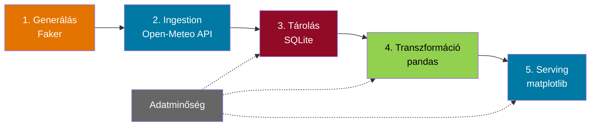

# Demo 1: Teljes Data Engineering Pipeline Python-ban

!!! info "Áttekintés"
    **Időtartam**: ~15 perc  
    **Platform**: Google Colab (vagy bármilyen Jupyter környezet)  
    **Nyelv**: Python  
    **Téma**: Időjárás/IoT – magyar városok hőmérséklet-elemzése  
    **Notebook**: [`demo1_python_pipeline.ipynb`](demo1_python_pipeline.ipynb)  

## Célkitűzés

A teljes Data Engineering életciklus bemutatása **kizárólag Python** eszközökkel, Docker és felhőszolgáltatás nélkül. A demó végigvezet mind az öt fázison, plusz az adatminőségi ellenőrzéseken (undercurrents).



---

## Előfeltételek

- [x] Google fiók (Colab-hoz)
- [x] Internetkapcsolat (API hívásokhoz)
- [ ] Docker **NEM szükséges**

!!! tip "Colab megnyitás"
    A notebook feltölthető a [Google Colab](https://colab.research.google.com/) felületre a `colab/demo1_python_pipeline.ipynb` fájllal, vagy közvetlenül megnyitható GitHub-ról.

---

## Pipeline lépések

### 1. Generálás (Generation)

A `Faker` library segítségével 10 magyar város időjárás-állomásának metaadatait generáljuk: város neve, koordináták (lat/lon), tengerszint feletti magasság.

```python title="Állomások generálása" linenums="1"
from faker import Faker
fake = Faker('hu_HU')

cities = [
    {"city": "Budapest",  "lat": 47.4979, "lon": 19.0402, "elevation": 96},
    {"city": "Debrecen",  "lat": 47.5316, "lon": 21.6273, "elevation": 121},
    # ... további 8 város
]
```

!!! note "Miért Faker?"
    Éles rendszerben a forrásadatok valódi szenzorokból vagy adatbázisokból érkeznek. A Faker segítségével szimulálhatjuk a metaadat-generálást tanulási célra.

---

### 2. Bevitel – Ingestion (Pull minta)

Az [Open-Meteo API](https://open-meteo.com/) segítségével **30 nap óránkénti** időjárási adatokat kérünk le minden állomáshoz. Ez egy tipikus **Pull ingestion** minta: mi kezdeményezzük a lekérést REST API-n keresztül.

=== "API hívás"
    ```python title="Open-Meteo lekérés"
    BASE_URL = "https://api.open-meteo.com/v1/forecast"
    params = {
        "latitude": 47.4979,
        "longitude": 19.0402,
        "hourly": "temperature_2m,relative_humidity_2m,wind_speed_10m,precipitation",
        "start_date": "2024-01-01",
        "end_date": "2024-01-31",
        "timezone": "Europe/Budapest"
    }
    response = requests.get(BASE_URL, params=params)
    ```

=== "Válasz struktúra"
    ```json title="API válasz (részlet)"
    {
      "hourly": {
        "time": ["2024-01-01T00:00", "2024-01-01T01:00", ...],
        "temperature_2m": [2.1, 1.8, 1.5, ...],
        "relative_humidity_2m": [85, 87, 89, ...],
        "wind_speed_10m": [12.3, 11.8, 10.5, ...]
      }
    }
    ```

!!! success "Várt eredmény"
    ~7 440 mérési rekord (10 állomás × 31 nap × 24 óra)

---

### 3. Tárolás (Storage) – SQLite

A nyers adatokat SQLite adatbázisba mentjük. Ez a **raw zóna** – az adatok változtatás nélkül kerülnek tárolásra.

```sql title="Séma" linenums="1"
CREATE TABLE stations (
    station_id TEXT PRIMARY KEY,
    city TEXT NOT NULL,
    latitude REAL,
    longitude REAL,
    elevation INTEGER
);

CREATE TABLE raw_weather (
    id INTEGER PRIMARY KEY AUTOINCREMENT,
    station_id TEXT REFERENCES stations(station_id),
    timestamp DATETIME NOT NULL,
    temperature_c REAL,
    humidity_pct REAL,
    wind_speed_kmh REAL,
    precipitation_mm REAL
);
```

!!! info "Éles környezetben"
    SQLite helyett PostgreSQL, Amazon S3 (data lake), vagy Apache Hive tárolás lenne – de az elv ugyanaz: a nyers adatokat változtatás nélkül tároljuk.

---

### 4. Transzformáció

A pandas library segítségével többlépéses transzformációt végzünk:

| Lépés | Művelet | Leírás |
|-------|---------|--------|
| 4.1 | Betöltés | SQLite → pandas DataFrame (JOIN stations + weather) |
| 4.2 | Tisztítás | Null kezelés, outlier szűrés (hőmérséklet: -40°C – 50°C) |
| 4.3 | Aggregáció | Óránkénti → napi: átlag, min, max hőmérséklet |
| 4.4 | Feature engineering | 7 napos mozgóátlag, napi hőingás |
| 4.5 | Anomália detekció | Z-score alapú: \|z\| > 2.0 → anomália |

```python title="Napi aggregáció"
daily = raw.groupby(["station_id", "city", "date"]).agg(
    avg_temp=("temperature_c", "mean"),
    min_temp=("temperature_c", "min"),
    max_temp=("temperature_c", "max"),
    total_precip=("precipitation_mm", "sum"),
).reset_index()
```

---

### 5. Kiszolgálás (Serving) – Dashboard

4 paneles matplotlib dashboard:

1. **Hőmérséklet trend** – 7 napos mozgóátlag, 5 város
2. **Átlaghőmérséklet** – városonkénti barplot
3. **Heatmap** – város × nap hőmérséklet mátrix
4. **Csapadék** – összesített csapadék városonként

!!! tip "Éles környezetben"
    A matplotlib helyett Tableau, PowerBI, Metabase vagy Streamlit dashboard lenne, amit az üzleti felhasználók böngészőben érnek el.

---

### 6. Adatminőség (Undercurrents)

5 automatikus ellenőrzés fut a pipeline végén:

- [x] **Teljesség** – legalább 95% adat megérkezett
- [x] **Frissesség** – legutóbbi adat < 48 órás
- [x] **Tartomány** – hőmérséklet [-50°C, 60°C] között
- [x] **Null arány** – max 5% hiányzó adat
- [x] **Egyediség** – minden állomás szerepel

---

## Használt Python csomagok

| Csomag | Verzió | Szerep |
|--------|--------|--------|
| `faker` | ≥18.0 | Szintetikus adat generálás |
| `requests` | ≥2.28 | HTTP API hívások |
| `pandas` | ≥2.0 | Adattranszformáció |
| `sqlite3` | stdlib | Könnyűsúlyú adatbázis |
| `matplotlib` | ≥3.7 | Vizualizáció |
| `seaborn` | ≥0.12 | Statisztikai vizualizáció |

---

## Lifecycle mapping

| DE Lifecycle fázis | Megvalósítás | Python eszköz |
|---|---|---|
| Generálás | Állomás metaadatok | `faker` |
| Bevitel (Ingestion) | REST API lekérés (Pull) | `requests` |
| Tárolás (Storage) | SQLite adatbázis | `sqlite3` |
| Transzformáció | Tisztítás, aggregáció, feature eng. | `pandas` |
| Kiszolgálás (Serving) | Dashboard vizualizáció | `matplotlib`, `seaborn` |
| Adatminőség | 5 automatikus ellenőrzés | assertions |
