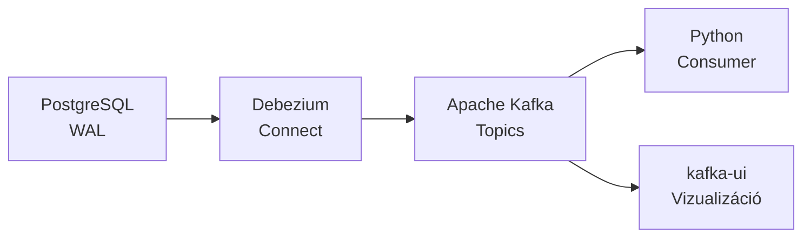

# Demo 1b: CDC Debezium-mal és Kafkával

**Notebook és scriptek**: [`github mappa`](https://github.com/BMEVIAUBXAV082/demok/tree/main/docs/demok/2/docker) 

## Áttekintés

Ez a demó az ipari szintű CDC (Change Data Capture) megoldást mutatja be: **Debezium** PostgreSQL connector, **Apache Kafka** üzenetküldés, és Python consumer a változások feldolgozásához.

!!! info "Előfeltételek"
    A Docker környezet fut (`docker compose up -d`), a Kafka és Debezium szolgáltatások elérhetők.

## Architektúra



## Indítás

```bash
# Docker környezet indítása
cd week02/docker
docker compose up -d

# Debezium connector regisztrálás (opcionális, a notebookban is megtehető)
bash debezium/register-postgres-connector.sh

# Kafka UI megnyitása: http://localhost:8080
# Jupyter notebook: http://localhost:8888 (token: bme2024)
```

## A demó lépései

### 1. Debezium Connector regisztrálása

A Debezium Kafka Connect REST API-ján keresztül regisztrálunk egy PostgreSQL connectort:

```json
{
    "name": "webshop-connector",
    "config": {
        "connector.class": "io.debezium.connector.postgresql.PostgresConnector",
        "database.hostname": "postgres",
        "database.dbname": "webshop",
        "topic.prefix": "webshop",
        "plugin.name": "pgoutput",
        "publication.name": "dbz_publication",
        "table.include.list": "public.customers,public.orders,public.order_items,public.products"
    }
}
```

!!! tip "Connector kezelés"
    - **Státusz**: `GET /connectors/webshop-connector/status`
    - **Törlés**: `DELETE /connectors/webshop-connector`
    - **Összes**: `GET /connectors`

### 2. Változások végrehajtása

A demóban végrehajtunk:

| Művelet | Tábla | Leírás |
|---------|-------|--------|
| INSERT | customers | Új ügyfél felvétele |
| UPDATE | customers | Szegmens módosítás |
| INSERT | orders | Új rendelés |
| UPDATE | orders | Státusz módosítás |
| DELETE | orders | Rendelés törlés |

### 3. CDC események Kafkában

A Debezium minden változást Kafka topic-okba ír: `webshop.public.<táblanév>`

Egy tipikus CDC esemény struktúrája:

```json
{
    "payload": {
        "op": "u",
        "before": {"customer_id": 31, "segment": "gold", "city": "Debrecen"},
        "after": {"customer_id": 31, "segment": "premium", "city": "Budapest"},
        "source": {
            "connector": "postgresql",
            "db": "webshop",
            "table": "customers",
            "lsn": 12345678
        },
        "ts_ms": 1700000000000
    }
}
```

**Műveletek kódjai**:

- `c` = CREATE (INSERT)
- `u` = UPDATE
- `d` = DELETE
- `r` = READ (snapshot)

### 4. Python Kafka Consumer

```python
from confluent_kafka import Consumer

consumer = Consumer({
    'bootstrap.servers': 'kafka:9092',
    'group.id': 'demo1b-consumer',
    'auto.offset.reset': 'earliest',
})
consumer.subscribe(['webshop.public.customers', 'webshop.public.orders'])
```

A consumer feldolgozza a before/after állapotokat és kiírja a változásokat.

### 5. kafka-ui vizualizáció

A [kafka-ui](http://localhost:8080) felületen vizuálisan áttekinthetők:

- **Topic-ok**: webshop.public.customers, webshop.public.orders, stb.
- **Üzenetek**: JSON tartalom a before/after állapotokkal
- **Consumer group-ok**: offset és lag monitoring

## Debezium vs Natív CDC összehasonlítás

| Szempont | Natív Python CDC | Debezium + Kafka |
|----------|-----------------|------------------|
| Komplexitás | Egyszerű | Közepesen összetett |
| Megbízhatóság | Saját implementáció | Battle-tested |
| Skálázhatóság | Korlátozott | Kafka-szintű |
| Offset kezelés | Manuális | Automatikus |
| Monitorozás | Nincs beépített | Kafka Connect metrics |
| Üzemeltetés | Minimális | Kafka cluster szükséges |

## Kulcsfontosságú tanulságok

1. A **Debezium** ipari szintű CDC megoldás, production-ready
2. A **Kafka** mint köztes réteg biztosítja a megbízható kézbesítést
3. A **before/after** állapotok lehetővé teszik a teljes változás-történet nyomon követését
4. A **Schema Registry** gondoskodik a sémakompatibilitásról
5. A **kafka-ui** kiváló eszköz a fejlesztés és hibakeresés során

## Kapcsolódó notebook

A teljes futtatható kód a `demo1b-debezium-cdc.ipynb` Jupyter notebookban található.
