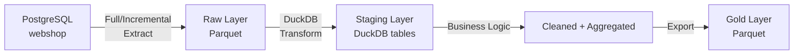

# Demo 2: Batch ETL/ELT pipeline DuckDB-vel

**Notebook és scriptek**: [`github mappa`](https://github.com/BMEVIAUBXAV082/demok/tree/main/docs/demok/2/docker) 

## Áttekintés

Ez a demó egy teljes **batch adatfeldolgozó pipeline**-t mutat be: PostgreSQL forrásból Parquet fájlokba extraktálunk, DuckDB-vel transzformálunk, SCD Type 2 dimenziót építünk, majd Gold réteg fájlokba töltünk.

!!! info "Előfeltételek"
    A Docker környezet fut (`docker compose up -d`). A Jupyter notebook elérhető a `http://localhost:8888` (token: bme2024) címen.

## Architektúra



## A demó lépései

### 1. Extract: Full Snapshot

Az összes tábla kinyerése PostgreSQL-ből Parquet fájlokba:

```python
import pyarrow as pa
import pyarrow.parquet as pq

pg_cur.execute("SELECT * FROM orders")
rows = pg_cur.fetchall()
columns = {k: [r[k] for r in rows] for k in rows[0].keys()}
arrow_table = pa.table(columns)
pq.write_table(arrow_table, "data/raw/orders.parquet")
```

!!! note "Full Extract korlátai"
    Nagy adatbázisoknál (100M+ sor) a full extract nem fenntartható. Naponta csak a változott adatokat érdemes kivenni.

### 2. Extract: Incremental

Csak az utolsó 7 napban módosult rendelések kinyerése:

```python
cutoff = datetime.now() - timedelta(days=7)
pg_cur.execute("SELECT * FROM orders WHERE order_date >= %s", (cutoff,))
```

**Full vs Incremental összehasonlítás** (tipikus arányok):

| Metrika | Full | Incremental |
|---------|------|------------|
| Sorok száma | 100% | ~10-20% |
| Adatméret | 100% | ~10-20% |
| Futási idő | 100% | ~15-25% |
| Terhelés | Magas | Alacsony |

### 3. Transform: Staging és Cleaned réteg

DuckDB-vel olvassuk be a Parquet fájlokat és létrehozzuk a staging táblákat:

```sql
-- Parquet betöltés DuckDB-be
CREATE OR REPLACE TABLE stg_orders AS
SELECT * FROM read_parquet('data/raw/orders.parquet');

-- Üzleti logika: csak érvényes rendelések + ügyfélnév
CREATE OR REPLACE TABLE cleaned_orders AS
SELECT
    o.order_id,
    c.name as customer_name,
    c.segment as customer_segment,
    o.total_amount,
    CASE
        WHEN o.total_amount >= 200000 THEN 'nagy'
        WHEN o.total_amount >= 50000 THEN 'kozepes'
        ELSE 'kis'
    END as order_size
FROM stg_orders o
JOIN stg_customers c ON o.customer_id = c.customer_id
WHERE o.status != 'cancelled';
```

### 4. SCD Type 2: Ügyfél dimenzió

A **Slowly Changing Dimension Type 2** teljes változástörténetet tart fenn:

| Mező | Leírás |
|------|--------|
| `valid_from` | Rekord érvényességének kezdete |
| `valid_to` | Rekord érvényességének vége (`9999-12-31` = aktuális) |
| `is_current` | Az aktuális verzió jelzője |
| `version` | Verziószám (1, 2, 3, ...) |

**Változás kezelése**:

1. A régi rekord `valid_to` mezőjét a változás időpontjára állítjuk, `is_current = FALSE`
2. Új rekordot szúrunk be a módosított adatokkal, `version + 1`

```sql
-- Régi rekord lezárása
UPDATE dim_customer_scd2
SET valid_to = CURRENT_TIMESTAMP, is_current = FALSE
WHERE customer_id = 42 AND is_current = TRUE;

-- Új verzió
INSERT INTO dim_customer_scd2
SELECT customer_id, name, 'Budapest', 'gold',
       CURRENT_TIMESTAMP, '9999-12-31', TRUE, version + 1
FROM dim_customer_scd2
WHERE customer_id = 42 AND is_current = FALSE
ORDER BY version DESC LIMIT 1;
```

!!! tip "SCD típusok összehasonlítása"
    - **SCD Type 1**: Felülírja a régi értéket (nincs történet)
    - **SCD Type 2**: Új sor + érvényességi dátum (teljes történet)
    - **SCD Type 3**: Extra "előző érték" oszlop (korlátozott történet)

### 5. Load: Gold réteg

A DuckDB táblák exportálása Parquet fájlokba:

```sql
COPY cleaned_orders TO 'data/gold/cleaned_orders.parquet' (FORMAT PARQUET);
COPY daily_sales    TO 'data/gold/daily_sales.parquet'    (FORMAT PARQUET);
COPY category_stats TO 'data/gold/category_stats.parquet' (FORMAT PARQUET);
```

### 6. DuckDB vs PostgreSQL teljesítmény

DuckDB **columnar** tárolása és vektorizált végrehajtása gyorsabb analitikai lekérdezéseknél:

| Lekérdezés típusa | PostgreSQL | DuckDB (Parquet) |
|-------------------|-----------|-----------------|
| Pont lekérdezés (single row) | Gyors | Lassabb |
| Aggregáció (GROUP BY) | Közepes | **Gyors** |
| Összetett JOIN + aggregáció | Lassabb | **Gyors** |
| Oszlop szűrés (SELECT a, b) | Minden oszlop olvas | **Csak szükséges** |

## Kulcsfontosságú tanulságok

1. A **Parquet** formátum ideális analitikai munkafolyamatokhoz: tömörített, columnar
2. Az **incremental extract** csökkenti a terhelést és a futási időt
3. A **DuckDB** kiváló embedded analytics engine: nincs szükség szerverre
4. Az **SCD Type 2** lehetővé teszi a historikus elemzéseket (mi volt egy ügyfél szegmense 3 hónapja?)
5. A **Medallion architektúra** (Raw → Staging → Gold) jól strukturálja az adatokat

## Kapcsolódó notebook

A teljes futtatható kód a `demo2-batch-pipeline.ipynb` Jupyter notebookban található.
