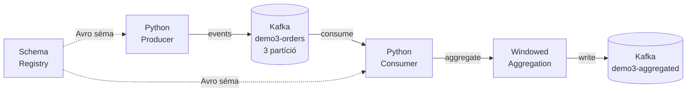

# Demo 3: Kafka Streaming Pipeline

## Áttekintés

Ez a demó a **streaming adatfeldolgozás** alapjait mutatja be Apache Kafka segítségével: producer, consumer, ablakos aggregáció, Schema Registry és kézbesítési garanciák.

!!! info "Előfeltételek"
    A Docker környezet fut (`docker compose up -d`). A Kafka UI elérhető a `http://localhost:8080` böngészőben.

## Architektúra



## Indítás

```bash
cd week02/docker
docker compose up -d

# Kafka UI: http://localhost:8080
# Jupyter: http://localhost:8888 (token: bme2024)
```

## A demó lépései

### 1. Kafka Topic-ok

Topic létrehozása Kafka AdminClient-tel:

```python
from confluent_kafka.admin import AdminClient, NewTopic

admin = AdminClient({'bootstrap.servers': 'kafka:9092'})
topics = [
    NewTopic("demo3-orders",     num_partitions=3, replication_factor=1),
    NewTopic("demo3-aggregated", num_partitions=1, replication_factor=1),
]
admin.create_topics(topics)
```

**Particionálás**: A `customer_id` a partíció kulcs, így az azonos ügyfél összes eseménye ugyanabba a partícióba kerül → sorrendiség garantált ügyfélenként.

### 2. Kafka Producer

```python
from confluent_kafka import Producer

producer = Producer({
    'bootstrap.servers': 'kafka:9092',
    'client.id': 'demo3-producer',
})

# Szimulált e-commerce esemény
event = {
    "event_id": "evt-0001",
    "event_type": "order_created",
    "customer_id": "customer_5",
    "product": "Laptop",
    "amount": 349990,
    "timestamp": "2024-11-20T14:32:11"
}

producer.produce(
    topic="demo3-orders",
    key=event["customer_id"].encode(),  # partition key!
    value=json.dumps(event).encode(),
)
producer.flush()
```

### 3. Kafka Consumer és Consumer Groups

```python
from confluent_kafka import Consumer

consumer = Consumer({
    'bootstrap.servers': 'kafka:9092',
    'group.id': 'demo3-consumer-group',    # Consumer group azonosítója
    'auto.offset.reset': 'earliest',        # Legrégebbi üzenettől olvass
})
consumer.subscribe(['demo3-orders'])

while True:
    msg = consumer.poll(2.0)
    if msg and not msg.error():
        event = json.loads(msg.value().decode())
        print(f"Partíció: {msg.partition()}, Offset: {msg.offset()}")
        # feldolgozás...
```

!!! note "Consumer Group szintű terheléselosztás"
    Ha egy consumer group-ban 3 consumer és 3 partíció van, Kafka automatikusan elosztja a partíciókat: minden consumer 1 partíciót olvas. Több consumer nem gyorsít tovább, mint ahány partíció van.

### 4. Ablakos aggregáció (Windowed Aggregation)

**Tumbling window** – nem átfedő, fix méretű időablakok:

```
|----W1----|----W2----|----W3----|
0s        10s        20s        30s
```

**Sliding window** – átfedő ablakok:

```
|---W1---|
   |---W2---|
      |---W3---|
```

A demóban egyszerű tumbling window-t valósítunk meg: eseménytípusonként és ügyfelenként összesítjük az eseményeket.

### 5. Schema Registry és Avro

Az Avro séma regisztrálása a Schema Registry-be:

```python
import requests

schema_v1 = {
    "type": "record",
    "name": "OrderEvent",
    "fields": [
        {"name": "event_id",   "type": "string"},
        {"name": "event_type", "type": "string"},
        {"name": "amount",     "type": "int"},
        {"name": "timestamp",  "type": "string"}
    ]
}

requests.post(
    "http://schema-registry:8081/subjects/demo3-orders-value/versions",
    json={"schemaType": "AVRO", "schema": json.dumps(schema_v1)}
)
```

**Sémaevolúció**: Új opcionális mezőt adunk hozzá (backward compatible):

```python
schema_v2 = {
    # ... az összes V1 mező ...
    {"name": "currency", "type": ["null", "string"], "default": None}  # UJ mezo
}
```

!!! success "Kompatibilitás szabályok"
    - **BACKWARD**: Régi consumer tud olvasni új adatot
    - **FORWARD**: Új consumer tud olvasni régi adatot
    - **FULL**: Mindkét irány kompatibilis
    - **NONE**: Nincs kompatibilitás-ellenőrzés

### 6. Kézbesítési garanciák

| Garantált | acks | retries | idempotence | Jellemző |
|-----------|------|---------|------------|---------|
| At-most-once | `0` | 0 | false | Leggyorsabb, üzenetvesztés lehetséges |
| At-least-once | `all` | >0 | false | Megbízható, duplikáció lehetséges |
| Exactly-once | `all` | >0 | true | Leglassabb, duplikáció-mentes |

```python
# Exactly-once producer
producer = Producer({
    'bootstrap.servers': 'kafka:9092',
    'acks': 'all',
    'enable.idempotence': True,
})
```

## Kafka UI: Vizualizáció

A [kafka-ui](http://localhost:8080) felületen elérhető:

- **Topics** → `demo3-orders`: üzenetek, partíciók, offsets
- **Consumer Groups** → `demo3-consumer-group`: lag monitoring
- **Schema Registry** → V1 és V2 sémák

## Kulcsfontosságú tanulságok

1. A **Kafka** garantált sorrendet tart partíción belül – a partition key megválasztása kritikus
2. A **consumer group** lehetővé teszi a horizontális skálázást
3. Az **ablakos aggregáció** az összetett streaming logika alapja
4. A **Schema Registry** biztosítja a producer-consumer kompatibilitást sémaevolúció esetén
5. Az **exactly-once** szemantika lehetséges Kafka-val, de teljesítmény kompromisszumokkal jár

## Kapcsolódó notebook

A teljes futtatható kód a `demo3-kafka-streaming.ipynb` Jupyter notebookban található.
