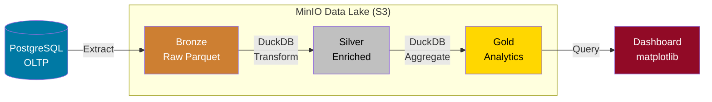
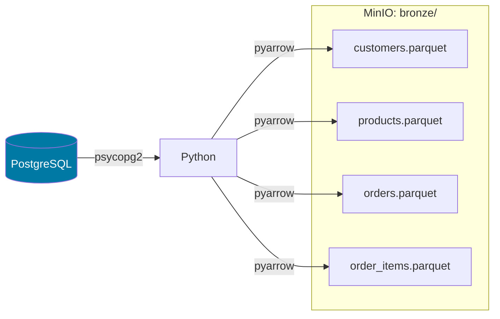

# Demo 2: Modern Data Engineering Pipeline

!!! info "Áttekintés"
    **Időtartam**: ~15 perc  
    **Platform**: Docker Compose (lokális)  
    **Eszközök**: PostgreSQL + MinIO + DuckDB + Jupyter  
    **Téma**: E-commerce – Medallion/Lakehouse architektúra  
    **Notebook és scriptek**: [`github mappa`](https://github.com/BMEVIAUBXAV082/demok/tree/main/docs/demok/2/docker)  

## Célkitűzés

Teljes DE pipeline bemutatása **modern, iparági eszközökkel**, lokálisan futtatva Docker-rel. A Medallion (Bronze/Silver/Gold) architektúrát implementáljuk, ami a modern data engineering iparági standardja.



---

## Előfeltételek

- [x] Docker Desktop telepítve és futtatva
- [x] `docker/` mappa tartalma (docker-compose.yml, init-scripts/)
- [x] Legalább 2 GB szabad RAM
- [ ] Internetkapcsolat **NEM szükséges** (minden lokálisan fut)

---

## 1. Környezet indítása

```bash title="Docker Compose indítás"
cd week01/docker
docker compose up -d postgres minio jupyter
```

!!! warning "Első indítás"
    Az első `docker compose up` alkalmával a Docker letölti a szükséges image-eket (~2 GB). Ez néhány percet vehet igénybe.

=== "Szolgáltatások"
    | Szolgáltatás | URL | Hitelesítés |
    |-------------|-----|-------------|
    | Jupyter Notebook | [http://localhost:8888](http://localhost:8888) | Token: `bme2024` |
    | MinIO Console | [http://localhost:9001](http://localhost:9001) | `minioadmin` / `minioadmin` |
    | pgAdmin | [http://localhost:5050](http://localhost:5050) | `admin@bme.hu` / `admin` |

=== "Állapot ellenőrzés"
    ```bash
    docker compose ps
    # Mindhárom szolgáltatás "Up" állapotban kell legyen
    ```

- [x] PostgreSQL fut (ecommerce DB, 4 tábla, ~200 sor seed data)
- [x] MinIO fut (S3-kompatibilis object storage)
- [x] Jupyter fut (pipeline notebook)

---

## 2. Pipeline lépések

### 2.1 MinIO Data Lake inicializálás

A MinIO S3-kompatibilis object storage – lokálisan fut, de ugyanúgy működik, mint az Amazon S3 vagy Google Cloud Storage. Létrehozunk egy `datalake` nevű bucket-et.

```python title="MinIO inicializálás"
from minio import Minio

minio_client = Minio(
    "minio:9000",
    access_key="minioadmin",
    secret_key="minioadmin",
    secure=False
)

minio_client.make_bucket("datalake")
```

!!! tip "MinIO Console"
    A MinIO webes felületén ([localhost:9001](http://localhost:9001)) böngészhetjük a feltöltött fájlokat, bucket-eket és objektumokat.

---

### 2.2 Extract → Bronze réteg

A Bronze réteg a **nyers, változatlan adatokat** tartalmazza. Az OLTP adatbázisból (PostgreSQL) kiolvassuk a 4 táblát és Parquet formátumban mentjük a MinIO-ba.



| Tábla | Sorok | Parquet méret |
|-------|-------|---------------|
| customers | 20 | ~2 KB |
| products | 15 | ~1.5 KB |
| orders | 30 | ~2 KB |
| order_items | 44 | ~2.5 KB |

!!! note "ELT minta"
    Ez az **Extract-Load-Transform (ELT)** minta: először kinyerjük és betöltjük a nyers adatokat, majd később transzformáljuk. Ez a modern megközelítés, szemben a hagyományos ETL-lel.

---

### 2.3 Bronze → Silver réteg (DuckDB)

A Silver réteg **tisztított, validált és joinolt** adatokat tartalmaz. A DuckDB az S3/MinIO-ról közvetlenül olvassa a Parquet fájlokat a `httpfs` kiterjesztéssel – nem kell letölteni a fájlokat!

```python title="DuckDB S3 konfiguráció"
con = duckdb.connect()
con.execute("INSTALL httpfs; LOAD httpfs;")
con.execute("SET s3_endpoint='minio:9000';")
con.execute("SET s3_access_key_id='minioadmin';")
con.execute("SET s3_secret_access_key='minioadmin';")
con.execute("SET s3_use_ssl=false;")
con.execute("SET s3_url_style='path';")
```

**Silver transzformáció**: 4 Bronze tábla JOIN → 1 enriched tábla

```sql title="orders_enriched (Silver)"
SELECT
    o.id AS order_id,
    o.order_date,
    o.status,
    c.name AS customer_name,
    c.city AS customer_city,
    p.name AS product_name,
    p.category AS product_category,
    oi.quantity,
    oi.unit_price,
    (oi.quantity * oi.unit_price) AS line_total
FROM bronze/orders.parquet o
JOIN bronze/customers.parquet c ON o.customer_id = c.id
JOIN bronze/order_items.parquet oi ON o.id = oi.order_id
JOIN bronze/products.parquet p ON oi.product_id = p.id
```

!!! success "Eredmény"
    `silver/orders_enriched.parquet` – denormalizált, analytics-ready tábla

---

### 2.4 Silver → Gold réteg (Aggregáció)

A Gold réteg **üzleti célú, aggregált** táblákat tartalmaz. Ezek közvetlenül felhasználhatók dashboard-ok vagy ML modellek által.

| Gold tábla | Leírás | Kulcs metrikák |
|-----------|--------|----------------|
| `daily_revenue` | Napi bevétel | order_count, total_revenue, avg_order_value |
| `customer_segments` | Ügyfélszegmensek (RFM) | total_spent, segment (Premium/Regular/New) |
| `product_performance` | Termék teljesítmény | total_qty_sold, total_revenue, in_orders |

```sql title="Ügyfélszegmentáció"
SELECT
    customer_name,
    SUM(line_total) AS total_spent,
    CASE
        WHEN SUM(line_total) > 500000 THEN 'Premium'
        WHEN SUM(line_total) > 100000 THEN 'Regular'
        ELSE 'New'
    END AS segment
FROM silver/orders_enriched.parquet
GROUP BY customer_name
```

---

### 2.5 Serving – Analytics Dashboard

4 paneles dashboard a Gold rétegből:

1. **Napi bevétel** – oszlopdiagram
2. **Ügyfélszegmensek** – kördiagram (Premium / Regular / New)
3. **Top 10 termék** – bevétel szerinti rangsor
4. **Rendelések városonként** – oszlopdiagram

!!! tip "Éles környezetben"
    A matplotlib helyett Metabase, Superset, vagy Tableau csatlakozna a Gold réteghez. A DuckDB + MinIO kombináció lehetővé teszi az SQL-alapú BI eszközök közvetlen használatát.

---

## 3. Data Lake struktúra

A pipeline futása után a MinIO-ban az alábbi struktúra jön létre:

```
datalake/
├── bronze/
│   ├── customers.parquet        # 20 sor  – nyers extract
│   ├── products.parquet         # 15 sor  – nyers extract
│   ├── orders.parquet           # 30 sor  – nyers extract
│   └── order_items.parquet      # 44 sor  – nyers extract
├── silver/
│   └── orders_enriched.parquet  # ~44 sor – joinolt, tisztított
└── gold/
    ├── daily_revenue.parquet    # ~N sor  – napi aggregáció
    ├── customer_segments.parquet # 20 sor – RFM szegmentáció
    └── product_performance.parquet # 15 sor – termék rangsor
```

---

## 4. Leállítás

```bash title="Szolgáltatások leállítása"
docker compose stop

# Adatok törlésével:
docker compose down -v
```

---

## Architektúra összefoglalás

| Komponens | Lokális (Docker) | Felhő megfelelő |
|-----------|-----------------|------------------|
| PostgreSQL | `de-postgres` | Amazon RDS, Cloud SQL |
| MinIO | `de-minio` | Amazon S3, GCS, Azure Blob |
| DuckDB | Jupyter-ben | Athena, BigQuery, Snowflake |
| Jupyter | `de-jupyter` | SageMaker, Vertex AI |

!!! quote "Tanulság"
    A Medallion architektúra (Bronze → Silver → Gold) iparági standard. A lokális Docker környezet 1:1-ben leképezi a felhős architektúrát – ugyanaz az elv, csak más skálán.
