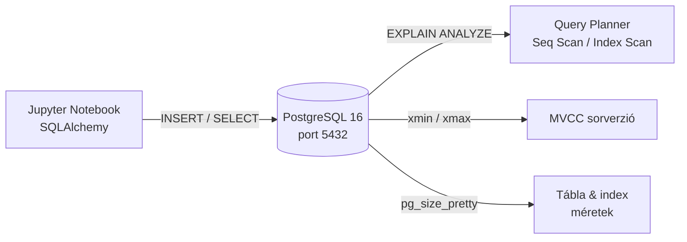

# Demo 1: PostgreSQL deep-dive

## Áttekintés

Ez a demó a relációs adatbázisok belső működését mutatja be élőben: B-tree indexelés és `EXPLAIN ANALYZE`, MVCC sorverzió-mechanizmus, normalizált vs. denormalizált lekérdezési teljesítmény.

!!! info "Előfeltételek"
    A Docker környezet fut (`docker compose up -d`). JupyterLab elérhető: **http://localhost:8888** (token: `demo`). Megnyitandó notebook: `demo1-postgresql.ipynb`.

## Indítás

```bash
cd week03/docker
docker compose up -d
# Ellenőrzés:
docker compose ps
```

## Architektúra



## A demó lépései

### 1. Adatbázis feltöltés

50 000 soros e-commerce adatbázis (customers, products, orders) létrehozása Faker-rel:

```python
fake = Faker("hu_HU")
fake.unique.clear()

cust_data = [
    {"name": fake.name(), "email": fake.unique.email(),
     "city": fake.city(), "segment": random.choice([...])}
    for _ in range(500)
]
pd.DataFrame(cust_data).to_sql("customers", engine, if_exists="append", index=False)
```

!!! tip "Miért `fake.unique.email()`?"
    A `fake.email()` a kis hu_HU locale miatt duplikátumokat generálhat – a UNIQUE constraint töri. A `fake.unique` garantálja az egyedi értékeket batch-en belül.

### 2. EXPLAIN ANALYZE – Seq Scan (index nélkül)

```sql
EXPLAIN ANALYZE
SELECT * FROM orders WHERE customer_id = 42;
```

Tipikus kimenet:
```
Seq Scan on orders  (cost=0.00..1543.00 rows=98 width=52)
                    (actual time=0.032..12.4 ms rows=99 loops=1)
  Filter: (customer_id = 42)
  Rows Removed by Filter: 49901
Planning Time: 0.1 ms
Execution Time: 12.6 ms
```

!!! note "Seq Scan"
    Szekvenciális vizsgálat: **minden sort** megvizsgál, O(n). 50 000 sorból 49 901-et kiszűr – hatékonytalan.

### 3. B-tree index + EXPLAIN ANALYZE újra

```sql
CREATE INDEX IF NOT EXISTS idx_orders_customer_id ON orders(customer_id);
ANALYZE orders;  -- statisztikák frissítése
```

```sql
EXPLAIN ANALYZE
SELECT * FROM orders WHERE customer_id = 42;
```

Tipikus kimenet:
```
Index Scan using idx_orders_customer_id on orders
  (cost=0.29..394.12 rows=99 width=52)
  (actual time=0.08..0.42 ms rows=99 loops=1)
  Index Cond: (customer_id = 42)
Execution Time: 0.5 ms
```

| Metrika | Seq Scan | Index Scan |
|---------|----------|-----------|
| Végrehajtási idő | ~12 ms | ~0.5 ms |
| Sorok megvizsgálva | 50 000 | ~99 |
| Teljesítmény javulás | 1× | **~25×** |

!!! tip "Mikor NEM érdemes index?"
    Kis tábláknál (< 1 000 sor) és alacsony szelektivitásnál (pl. boolean oszlop) a Seq Scan gyorsabb – a query optimizer automatikusan dönt.

### 4. MVCC – sorverzió-mechanizmus

```python
# Rendszeroszlopok megjelenítése
with engine.connect() as conn:
    result = conn.execute(text(
        "SELECT customer_id, name, xmin, xmax FROM customers LIMIT 5"
    ))
```

```python
# Tranzakció demonstrációja
with engine.connect() as conn:
    conn.execute(text("BEGIN"))
    conn.execute(text(
        "UPDATE customers SET city = 'MVCC_DEMO_CITY' WHERE customer_id = 1"
    ))
    # -> tranzakción BELÜL: az új értéket látjuk
    conn.execute(text("ROLLBACK"))
    # -> ROLLBACK után: az eredeti érték megmaradt
```

| Oszlop | Jelentés |
|--------|---------|
| `xmin` | A sort létrehozó tranzakció ID-ja |
| `xmax` | A sort törlő/módosító tranzakció ID-ja (0 = él a sor) |

!!! note "MVCC lényege"
    Minden olvasó tranzakció egy **konzisztens snapshotot** lát a START idejéből. Az írók nem blokkolják az olvasókat – ez teszi lehetővé a párhuzamosságot ACID mellett.

### 5. Normalizált vs. denormalizált teljesítmény

Háromtáblás JOIN aggregáció (normalizált):

```sql
SELECT c.name, c.segment, p.category,
       COUNT(*) AS order_count, SUM(o.total_amount) AS revenue
FROM orders o
JOIN customers c ON o.customer_id = c.customer_id
JOIN products  p ON o.product_id  = p.product_id
WHERE o.status = 'delivered'
GROUP BY c.name, c.segment, p.category
ORDER BY revenue DESC
LIMIT 10
```

Az eredmény: hideg futás (~80–150 ms) vs. meleg futás (~10–30 ms) – a shared buffer cache hatása.

### 6. Tábla- és index-méretek

```sql
SELECT tablename,
       pg_size_pretty(pg_total_relation_size(quote_ident(tablename))) AS total,
       pg_size_pretty(pg_relation_size(quote_ident(tablename)))        AS table_only
FROM pg_tables
WHERE schemaname = 'public'
ORDER BY pg_total_relation_size(quote_ident(tablename)) DESC;
```

Tipikus arányok: az index mérete az orders táblán kb. 20-30%-a a tábla méretének.

## Kulcsfontosságú tanulságok

1. **B-tree index** O(log n) keresést tesz lehetővé – szelektív szűrőnél 20–100× gyorsítás
2. **EXPLAIN ANALYZE** megmutatja a *valódi* végrehajtási tervet és az időket – mindig ezt futtasd teszteléskor
3. **MVCC** garantálja, hogy olvasók nem blokkolják az írókat – de a VACUUM szükséges a halott verziók tisztításához
4. **Shared buffer cache** a legfontosabb hangolási paraméter: `shared_buffers = 25% RAM`
5. A **normalizált JOIN** megfelelő indexelés esetén elfogadható – az összetett aggregáció teljesítményéhez OLAP rendszer kell

## Kapcsolódó notebook

`week03/docker/notebooks/demo1-postgresql.ipynb`
