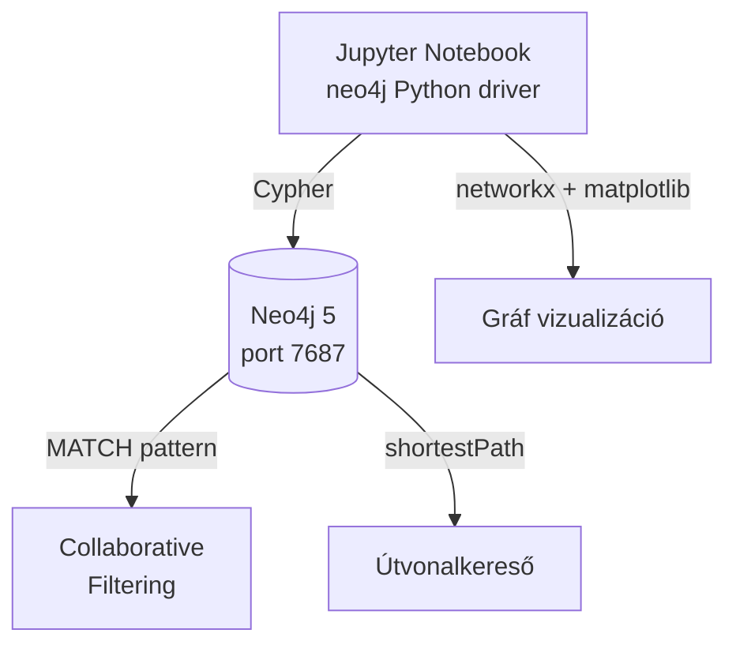

# Demo 3: Neo4j – gráf adatbázis

## Áttekintés

Ez a demó a gráf adatbázisok erejét mutatja be: ajánlórendszer (collaborative filtering), útvonalkereső és közösség-vizualizáció Cypher lekérdező nyelvvel, a relációs megközelítéssel összehasonlítva.

!!! info "Előfeltételek"
    A Docker környezet fut. JupyterLab: **http://localhost:8888** (token: `demo`). Notebook: `demo3-neo4j.ipynb`. Neo4j Browser: **http://localhost:7474** (felhasználó: `neo4j`, jelszó: `password123`).

## Architektúra



## Adatmodell

```
(:Customer {name, segment})
    -[:BOUGHT {qty, date, amount}]->
(:Product {name, price})
    -[:IN_CATEGORY]->
(:Category {name})
```

A gráfban:
- **50** Customer csomópont
- **50** Product csomópont
- **5** Category csomópont
- **~200** BOUGHT él (vásárlási kapcsolatok)
- **50** IN_CATEGORY él

## A demó lépései

### 1. Csomópontok és élek létrehozása

```python
from neo4j import GraphDatabase

driver = GraphDatabase.driver("bolt://neo4j:7687", auth=("neo4j", "password123"))

with driver.session() as session:
    # Customer csomópontok
    session.run("""
        UNWIND $customers AS c
        CREATE (:Customer {id: c.id, name: c.name, segment: c.segment})
    """, customers=customers_list)

    # BOUGHT élek
    session.run("""
        UNWIND $purchases AS p
        MATCH (c:Customer {id: p.customer_id})
        MATCH (pr:Product {id: p.product_id})
        CREATE (c)-[:BOUGHT {qty: p.qty, amount: p.amount, date: p.date}]->(pr)
    """, purchases=purchases_list)
```

### 2. Alap lekérdezések Cypher-rel

```cypher
-- Ki vásárolta a legtöbb terméket?
MATCH (c:Customer)-[:BOUGHT]->(p:Product)
RETURN c.name, COUNT(p) AS product_count
ORDER BY product_count DESC
LIMIT 5

-- Melyik kategóriából vásároltak legtöbbet?
MATCH (:Customer)-[:BOUGHT]->(p:Product)-[:IN_CATEGORY]->(cat:Category)
RETURN cat.name, SUM(1) AS purchase_count
ORDER BY purchase_count DESC
```

### 3. Ajánlórendszer – collaborative filtering

```cypher
-- "Akik X-et vették, Y-t is vették" típusú ajánlás
MATCH (target:Customer {id: $customer_id})-[:BOUGHT]->(p:Product)
      <-[:BOUGHT]-(similar:Customer)
WHERE target <> similar
WITH similar, COUNT(p) AS shared_products
ORDER BY shared_products DESC
LIMIT 5
MATCH (similar)-[:BOUGHT]->(recommended:Product)
WHERE NOT (target)-[:BOUGHT]->(recommended)
RETURN recommended.name, recommended.category,
       COUNT(*) AS recommendation_score
ORDER BY recommendation_score DESC
LIMIT 10
```

!!! note "Relációs DB-vel összehasonlítva"
    Ugyanez SQL-ben: `customers JOIN orders JOIN products JOIN orders JOIN customers` – 4 JOIN, exponenciálisan lassul mélyebb gráfon. Neo4j-ban pointer-követés: O(kapcsolatok száma).

### 4. Útvonalkereső

```cypher
-- Leghosszabb vásárlói lánc: ki vett a legtöbb közös termékkel?
MATCH path = (c1:Customer)-[:BOUGHT*2..4]->(c2:Customer)
WHERE c1 <> c2
RETURN c1.name, c2.name, LENGTH(path) AS chain_length
ORDER BY chain_length DESC
LIMIT 5

-- Hány lépésen keresztül érünk el egy adott ügyféltől egy termékig?
MATCH p = shortestPath(
    (c:Customer {name: "Kovács János"})-[*]-(pr:Product {name: "Laptop Pro-001"})
)
RETURN length(p), [n IN nodes(p) | coalesce(n.name, '')] AS path_nodes
```

### 5. Top termékek PageRank-analóg lekérdezéssel

```cypher
-- Legtöbb BOUGHT kapcsolattal rendelkező termékek
MATCH (p:Product)<-[:BOUGHT]-(c:Customer)
WITH p, COUNT(c) AS buyer_count, SUM(1) AS total_purchases
RETURN p.name, p.category, buyer_count, total_purchases
ORDER BY total_purchases DESC
LIMIT 10
```

### 6. NetworkX vizualizáció

```python
import networkx as nx
import matplotlib.pyplot as plt

G = nx.DiGraph()

with driver.session() as session:
    result = session.run("""
        MATCH (c:Customer)-[b:BOUGHT]->(p:Product)
        RETURN c.name AS customer, p.name AS product, b.qty AS qty
        LIMIT 50
    """)
    for record in result:
        G.add_node(record["customer"], node_type="customer")
        G.add_node(record["product"],  node_type="product")
        G.add_edge(record["customer"], record["product"], weight=record["qty"])

# Rajzolás
customer_nodes = [n for n,d in G.nodes(data=True) if d.get("node_type")=="customer"]
product_nodes  = [n for n,d in G.nodes(data=True) if d.get("node_type")=="product"]

pos = nx.spring_layout(G, seed=42)
nx.draw_networkx_nodes(G, pos, nodelist=customer_nodes, node_color="#0077B6", node_size=300)
nx.draw_networkx_nodes(G, pos, nodelist=product_nodes,  node_color="#F77F00", node_size=200)
nx.draw_networkx_edges(G, pos, alpha=0.3, arrows=True)
plt.title("Vásárlói gráf – Customer → Product")
plt.axis("off")
plt.savefig("f3_graph.png", dpi=150, bbox_inches="tight")
plt.show()
```

## Cypher vs. SQL összehasonlítás

| Feladat | SQL | Cypher |
|---------|-----|--------|
| Közvetlen vásárlás | 1 JOIN | `MATCH (c)-[:BOUGHT]->(p)` |
| Barátok barátai | 3 JOIN | `MATCH (c)-[:BOUGHT*2]->(p)` |
| K-hop traversal (K=5) | 5 JOIN, exponenciális | O(kapcsolatok száma) |
| Leghosszabb út | Rekurzív CTE | `shortestPath()` beépített |

## Kulcsfontosságú tanulságok

1. **Gráf adatbázis** akkor erős, ha a kapcsolatok "first-class citizen"-ek – nem JOIN tábla, hanem önálló entitás
2. **Index-free adjacency**: pointer-követés O(1) szomszédonként – nem degradál mélyebb gráfon
3. **Cypher** ASCII-art alapú pattern matching – intuitív és olvasható
4. **Collaborative filtering** 5 sorban megírható Cypher-rel – ajánlórendszer alapja
5. **Neo4j Browser** (localhost:7474) vizuális gráf nézettel a fejlesztés megkönnyítéséhez

## Kapcsolódó notebook

`week03/docker/notebooks/demo3-neo4j.ipynb`
