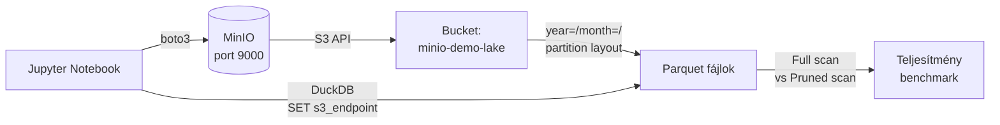

# Demo 4: MinIO + DuckDB – Object Storage & Data Lake

## Áttekintés

Ez a demó S3-kompatibilis objektum tárolást (MinIO) és DuckDB közvetlen S3-olvasást mutat be, beleértve a particionált Parquet fájlokat és a partition pruning teljesítmény-hatását.

!!! info "Előfeltételek"
    A Docker környezet fut. JupyterLab: **http://localhost:8888** (token: `demo`). Notebook: `demo4-object-storage.ipynb`. MinIO Console: **http://localhost:9001** (user: `minioadmin`, password: `minioadmin`).

## Architektúra



## A demó lépései

### 1. MinIO bucket létrehozása

```python
import boto3
from botocore.client import Config

s3 = boto3.client(
    "s3",
    endpoint_url="http://minio:9000",
    aws_access_key_id="minioadmin",
    aws_secret_access_key="minioadmin",
    config=Config(signature_version="s3v4"),
    region_name="us-east-1"
)

s3.create_bucket(Bucket="minio-demo-lake")
print("✓ Bucket létrehozva: minio-demo-lake")
```

!!! note "MinIO vs AWS S3"
    MinIO teljesen S3-kompatibilis API-val – ugyanaz a boto3 kód fut, csak az `endpoint_url` különbözik. Lokális fejlesztésre és on-premise adatplatformokra ideális.

### 2. Particionált Parquet fájlok feltöltése

```python
import pyarrow as pa
import pyarrow.parquet as pq
import io

# year/month szerint particionálva
for year in [2023, 2024]:
    for month in range(1, 13):
        df_partition = df_orders[
            (df_orders["year"] == year) & (df_orders["month"] == month)
        ]
        if len(df_partition) == 0:
            continue

        buf = io.BytesIO()
        pq.write_table(pa.Table.from_pandas(df_partition), buf)
        buf.seek(0)

        key = f"orders/year={year}/month={month:02d}/part-0.parquet"
        s3.put_object(Bucket="minio-demo-lake", Key=key, Body=buf.read())

print(f"✓ {file_count} Parquet fájl feltöltve")
```

A feltöltött struktúra az S3-ban:
```
minio-demo-lake/
└── orders/
    ├── year=2023/
    │   ├── month=01/part-0.parquet
    │   ├── month=02/part-0.parquet
    │   └── ...
    └── year=2024/
        ├── month=01/part-0.parquet
        └── ...
```

### 3. DuckDB S3 konfiguráció

```python
import duckdb

con = duckdb.connect()

con.execute("""
    SET s3_endpoint    = 'localhost:9000';
    SET s3_use_ssl     = false;
    SET s3_url_style   = 'path';
    SET s3_access_key_id     = 'minioadmin';
    SET s3_secret_access_key = 'minioadmin';
""")
print("✓ DuckDB S3 konfiguráció kész")
```

### 4. Lekérdezés közvetlenül S3-ból

```python
# Összes adat betöltése – full scan
df = con.execute("""
    SELECT *
    FROM read_parquet('s3://minio-demo-lake/orders/**/*.parquet')
    LIMIT 10
""").df()

# Aggregáció az S3-on lévő Parquet-on
df_agg = con.execute("""
    SELECT year, month, COUNT(*) AS cnt, SUM(total_amount) AS revenue
    FROM read_parquet('s3://minio-demo-lake/orders/**/*.parquet')
    GROUP BY year, month
    ORDER BY year, month
""").df()
```

### 5. Partition pruning benchmark

```python
import time

# Full scan – minden partíció olvasva
t0 = time.time()
con.execute("""
    SELECT COUNT(*), SUM(total_amount)
    FROM read_parquet('s3://minio-demo-lake/orders/**/*.parquet')
""").fetchone()
t_full = (time.time() - t0) * 1000

# Partition-pruned scan – csak 2024/03 olvasva
t0 = time.time()
con.execute("""
    SELECT COUNT(*), SUM(total_amount)
    FROM read_parquet('s3://minio-demo-lake/orders/year=2024/month=03/*.parquet')
""").fetchone()
t_pruned = (time.time() - t0) * 1000

print(f"Full scan:   {t_full:.0f} ms  (24 partíció)")
print(f"Pruned scan: {t_pruned:.0f} ms  (1 partíció)")
print(f"Speedup:     {t_full/t_pruned:.1f}×")
```

Tipikus eredmény:

| Scan típus | Olvasott partíciók | Idő | Speedup |
|-----------|-------------------|-----|---------|
| Full scan | 24/24 | ~600 ms | 1× |
| Pruned scan (1 hónap) | 1/24 | ~40 ms | **~15×** |

!!! tip "Partition pruning automatizálása"
    Ha Iceberg vagy Delta Lake table format-ot használunk, a WHERE feltételből a pruning **automatikus** – nem kell explicit path-ot megadni. A DuckDB natív Parquet-nél a path szűkítése az egyetlen módja.

### 6. Helyi vs. S3 Parquet összehasonlítás

```python
# Helyi Parquet fájlra írás + olvasás
pq.write_table(pa.Table.from_pandas(df_orders), "/tmp/orders_local.parquet")

t0 = time.time()
con.execute("SELECT COUNT(*) FROM read_parquet('/tmp/orders_local.parquet')").fetchone()
t_local = (time.time() - t0) * 1000

t0 = time.time()
con.execute("""
    SELECT COUNT(*) FROM read_parquet('s3://minio-demo-lake/orders/**/*.parquet')
""").fetchone()
t_s3 = (time.time() - t0) * 1000

print(f"Helyi Parquet: {t_local:.0f} ms")
print(f"S3 Parquet:    {t_s3:.0f} ms  (+{t_s3-t_local:.0f} ms hálózati overhead)")
```

## Kulcsfontosságú tanulságok

1. **Objektum tárolás flat namespace**: a `year=/month=/` path prefix – ez egy string kulcs, az S3 nem tudja, hogy mappa
2. **DuckDB közvetlenül olvas S3-ból** – nem kell az adatot letölteni, majd feldolgozni
3. **Partition pruning** 15× gyorsulást adhat – a helyes particionálási kulcs megválasztása kritikus
4. **MinIO = on-premise S3** – ugyanaz a kód, más endpoint; cloud lock-in elkerülhető
5. **Parquet tömörítés**: az S3-on tárolt Parquet ~5-10× kisebb a CSV-nél – direkt tárhely-megtakarítás

## Kapcsolódó notebook

`week03/docker/notebooks/demo4-object-storage.ipynb`
