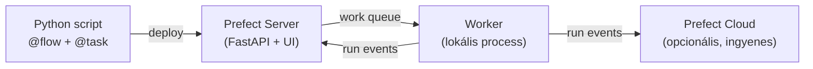

# Demo 2: Prefect – Python-first orchestration

## Áttekintés

Ez a demó bemutatja a Prefect orchestration eszközt: ugyanazt az extract → validate → transform → load pipeline-t írjuk meg Prefect-ben, amit az Airflow demóban Airflow-val. A cél az összehasonlítás: kevesebb konfigurációval, tisztább kóddal, Prefect Cloud ingyenes tier-rel monitorozva.

!!! info "Előfeltételek"
    Python 3.11+, `pip install prefect==2.19.0`. Notebook: `demo2-prefect.ipynb`. Opcionális: Prefect Cloud fiók (ingyenes) a monitoring-hoz.

## Airflow vs Prefect szemléletmód

| Szempont | Airflow | Prefect |
|---|---|---|
| DAG definíció | Statikus Python fájl, Scheduler parseol | Dinamikus – futáskor épül fel |
| Futtatáshoz szükséges | Scheduler + Webserver + DB | `pip install prefect` (self-contained) |
| XCom / adatátadás | Explicit push/pull | `return` értéke automatikusan átadódik |
| Retry | `default_args` | `@task(retries=N)` |
| Cache | Nincs beépített | `task_input_hash` |
| Lokális futtatás | Nem egyszerű | `python etl.py` – azonnal fut |

=== "Airflow"
    ```python
    with DAG("etl", schedule="@daily", start_date=datetime(2024,1,1)) as dag:
        extract   = PythonOperator(task_id="extract",   python_callable=fn_extract)
        transform = PythonOperator(task_id="transform", python_callable=fn_transform)
        extract >> transform
    ```

=== "Prefect"
    ```python
    @flow
    def etl():
        data = extract()       # @task – dependency automatikus
        transform(data)        # @task – return value = adatátadás

    etl()   # azonnal futtatható, Scheduler nélkül
    ```

## Architektúra



## Első Prefect flow

### 1. @task paraméterek

```python
@task(
    retries=2,                    # 2x újrapróbálkozik megbukás után
    retry_delay_seconds=5,        # retryek között 5s várakozás
    log_prints=True,              # print() automatikusan logolódik
    name="extract-orders",        # UI-ban megjelenő név (opcionális)
)
def extract_orders(date: str) -> list[dict]:
    ...
```

### 2. Minimális ETL flow

```python title="etl_flow.py" linenums="1"
from prefect import flow, task
from prefect.logging import get_run_logger
import random

@task(retries=2, retry_delay_seconds=10, log_prints=True)
def extract_orders(date: str) -> list[dict]:
    records = [{"id": i, "amount": round(random.uniform(100, 50000), 2), "date": date}
               for i in range(1, 101)]
    print(f"Letöltött rekordok: {len(records)}")
    return records   # return → automatikus adatátadás (nincs xcom_push)

@task(log_prints=True)
def validate_orders(records: list[dict]) -> list[dict]:
    valid = [r for r in records if r["amount"] > 0]
    print(f"Validált rekordok: {len(valid)}")
    return valid

@task(log_prints=True)
def transform_orders(records: list[dict]) -> dict:
    total = sum(r["amount"] for r in records)
    result = {"total_revenue": round(total, 2), "order_count": len(records)}
    print(f"Összesítés: {result}")
    return result

@task(log_prints=True)
def load_to_dw(summary: dict) -> None:
    print(f"DW-ba töltve: {summary}")

@flow(name="etl-pipeline", log_prints=True)
def etl_pipeline(date: str = "2024-01-15"):
    raw     = extract_orders(date)       # return value automatikusan átadódik
    clean   = validate_orders(raw)       # nincs xcom_pull – csak paraméterátadás
    summary = transform_orders(clean)
    load_to_dw(summary)

if __name__ == "__main__":
    etl_pipeline()   # Lokális futtatás – Scheduler nélkül
```

!!! success "Várt eredmény"
    `python etl_flow.py` futtatásakor a terminálban látjuk a task log-okat. Nincs szükség Scheduler-re, Webserver-re vagy adatbázisra.

## Task cache – azonos input esetén nem fut újra

### 3. task_input_hash cache

```python title="cached_flow.py" linenums="1"
from prefect import flow, task
from prefect.tasks import task_input_hash
from datetime import timedelta

@task(
    cache_key_fn=task_input_hash,        # azonos input → cache hit
    cache_expiration=timedelta(hours=1), # 1 óra után a cache lejár
)
def fetch_exchange_rates(date: str) -> dict:
    print(f"API hívás: {date}")   # cache hit esetén ez NEM fut
    return {"EUR": 390.5, "USD": 362.1, "date": date}

@flow
def daily_fx_pipeline(date: str = "2024-03-15"):
    rates = fetch_exchange_rates(date)
    print(f"Árfolyamok: {rates}")

daily_fx_pipeline(date="2024-03-15")   # API hívás
daily_fx_pipeline(date="2024-03-15")   # cache hit – nem hív API-t
daily_fx_pipeline(date="2024-03-16")   # cache miss – API hívás
```

!!! note "task_input_hash működése"
    A `task_input_hash` a task nevéből + összes paraméter hash-éből képzi a kulcsot. Manuális cache key is megírható: `cache_key_fn=lambda ctx, params: f"{params['date']}"`.

**Mikor hasznos?**
- Drága API hívások (ML feature extraction, külső adatszolgáltatók)
- Fejlesztés közben: gyorsabb iteráció (nem kell minden futásnál végigvárnni)
- Idempotens transzformációk: ha a forrás nem változott, az eredmény sem változott

## Subflow – moduláris pipeline

### 4. Flow-on belüli flow

```python title="modular_flow.py" linenums="1"
from prefect import flow, task

@flow(name="extract-subflow")
def extract_subflow(date: str) -> list[dict]:
    return [{"id": i, "amount": 1000.0, "date": date} for i in range(1, 11)]

@flow(name="transform-subflow")
def transform_subflow(records: list[dict]) -> list[dict]:
    return [{"id": r["id"], "amount_huf": r["amount"] * 390} for r in records]

@flow(name="master-etl-pipeline")
def master_pipeline(dates: list[str]) -> dict:
    """Master flow: több napot dolgoz fel subflow-okkal."""
    results = {}
    for date in dates:
        raw         = extract_subflow(date)      # subflow hívás
        transformed = transform_subflow(raw)     # subflow hívás
        results[date] = len(transformed)
    return results

master_pipeline(["2024-01-01", "2024-01-02", "2024-01-03"])
```

!!! tip "Subflow előnyei"
    - A Prefect UI-ban fa struktúrában jelennek meg: master flow → subflow → task
    - Minden subflow önállóan újrafuttatható (pl. ha csak az extract bukott meg)
    - Újrafelhasználható: ugyanazt a subflow-t más master flow is meghívhatja

## Deployment és ütemezés

### 5. Deployment létrehozása és ütemezés

```yaml title="prefect.yaml"
name: etl-daily
entrypoint: etl_flow.py:etl_pipeline
schedules:
  - cron: "0 3 * * *"
    timezone: "Europe/Budapest"
    active: true
work_pool:
  name: default-agent-pool
  work_queue_name: default
```

```bash
# Prefect szerver indítása
prefect server start
# UI: http://localhost:4200

# Worker indítása (végrehajtja a flow-kat)
prefect worker start --pool "default-agent-pool"

# Deployment manuális trigger-elése
prefect deployment run "etl-pipeline/etl-daily"
```

### Work Pool típusok

| Típus | Infrastruktúra | Mikor? |
|---|---|---|
| `process` | Lokális subprocess | Fejlesztés, kis terhelés |
| `docker` | Docker container | Izolált függőségek |
| `kubernetes` | K8s Pod | Nagy skála, cloud |

### Prefect Cloud vs self-hosted

| Szempont | Prefect Cloud (ingyenes) | Self-hosted |
|---|---|---|
| Telepítés | Regisztráció → kész | `prefect server start` |
| UI | cloud.prefect.io | localhost:4200 |
| Adattárolás | Prefect szerverein | Saját DB-ben |
| Limitet | 3 workspace, 500K run/hó | Korlátlan |

!!! example "Demo beadandó – f2.png"
    Képernyőkép a Prefect UI-ból (http://localhost:4200) az `etl-pipeline` flow sikeres futásáról, ahol láthatók a task-ok státuszai és a log-ok.

## Mikor válasszuk a Prefect-et?

```
Pythonos, kód-first megközelítés kell?
├── IGEN → Prefect
│   ├── Dinamikus gráf (runtime döntések) → Prefect
│   ├── Task cache kell → Prefect
│   └── Kis infrastruktúra igény → Prefect
└── NEM → Airflow (ha nagy csapat, sok meglévő integráció)
```
