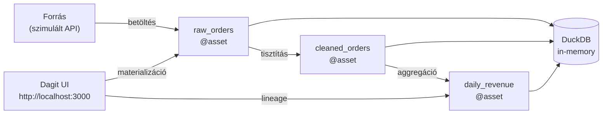

# Demo 3: Dagster – asset graph és materializáció

## Áttekintés

Ez a demó bemutatja a Dagster asset-alapú orchestration megközelítését. Három Software-Defined Asset-et definiálunk egy analitikai pipeline-hoz: `raw_orders → cleaned_orders → daily_revenue`. A Dagit UI-ban vizualizáljuk az asset gráfot, beállítunk Freshness Policy-t, és bemutatjuk a Resource absztrakciót.

!!! info "Előfeltételek"
    Python 3.11+, `pip install dagster dagster-webserver duckdb`. Notebook: `demo3-dagster.ipynb`. Dagit UI: **http://localhost:3000**.

## Task-centric vs asset-centric szemlélet

| Szemlélet | Eszköz | Kérdés | Analógia |
|---|---|---|---|
| Task-centric | Airflow, Prefect | Mit csináljunk? | Gyártósor – utasítások sorozata |
| Asset-centric | Dagster | Mit hozzunk létre? | Raktárrendszer – adatobjektumok |

**Példa ugyanarra a pipeline-ra:**

=== "Task-centric (Airflow)"
    ```python
    extract >> clean >> aggregate   # utasítások sorrendje a fő
    ```

=== "Asset-centric (Dagster)"
    ```python
    @asset                          # "mi keletkezik?" a fő
    def raw_orders(): ...

    @asset                          # automatikusan tudja: raw_orders kell hozzá
    def cleaned_orders(raw_orders): ...
    ```

## Architektúra



## Asset definíciók

### 1. Három @asset – az analitikai pipeline

```python title="assets.py" linenums="1"
import duckdb, random
from datetime import date, timedelta
from dagster import (
    asset, AssetIn, FreshnessPolicy, ConfigurableResource,
    materialize, Definitions, Output, MetadataValue
)

# Resource: DuckDB kapcsolat – nem importálunk direkt, hanem dependency injection
class DuckDBResource(ConfigurableResource):
    """Konfigurálható DuckDB kapcsolat.
    Fejlesztésben: database=':memory:', prod-ban: database='/data/orders.duckdb'"""
    database: str = ":memory:"

    def get_connection(self):
        return duckdb.connect(self.database)


@asset(description="Nyers rendelési adatok", tags={"layer": "bronze"})
def raw_orders(context, duckdb_resource: DuckDBResource) -> None:
    con = duckdb_resource.get_connection()
    rows = [{"id": i, "amount": round(random.uniform(-100, 50000), 2),
             "date": (date.today() - timedelta(days=i % 30)).isoformat()}
            for i in range(1, 201)]
    con.execute("DROP TABLE IF EXISTS raw_orders")
    con.execute("CREATE TABLE raw_orders AS SELECT * FROM rows")
    count = con.execute("SELECT COUNT(*) FROM raw_orders").fetchone()[0]
    context.log.info(f"raw_orders: {count} sor betöltve")


@asset(
    ins={"raw_orders": AssetIn()},     # explicit upstream: raw_orders kell
    description="Tisztított adatok",
    freshness_policy=FreshnessPolicy(maximum_lag_minutes=60 * 24),  # max 24h
)
def cleaned_orders(context, raw_orders, duckdb_resource: DuckDBResource) -> None:
    con = duckdb_resource.get_connection()
    con.execute("DROP TABLE IF EXISTS cleaned_orders")
    con.execute("""
        CREATE TABLE cleaned_orders AS
        SELECT order_id, customer_id, amount, status, CAST(order_date AS DATE) AS order_date
        FROM raw_orders
        WHERE amount > 0 AND status IS NOT NULL AND status != 'cancelled'
    """)
    raw_c   = con.execute("SELECT COUNT(*) FROM raw_orders").fetchone()[0]
    clean_c = con.execute("SELECT COUNT(*) FROM cleaned_orders").fetchone()[0]
    context.add_output_metadata({       # metadata: Dagit UI-ban látható
        "raw_count":    MetadataValue.int(raw_c),
        "clean_count":  MetadataValue.int(clean_c),
        "filtered_pct": MetadataValue.float(round((raw_c - clean_c) / raw_c * 100, 1)),
    })


@asset(
    ins={"cleaned_orders": AssetIn()},
    description="Napi bevétel aggregáció",
    freshness_policy=FreshnessPolicy(maximum_lag_minutes=60 * 24),
)
def daily_revenue(context, cleaned_orders, duckdb_resource: DuckDBResource) -> None:
    con = duckdb_resource.get_connection()
    con.execute("DROP TABLE IF EXISTS daily_revenue")
    con.execute("""
        CREATE TABLE daily_revenue AS
        SELECT order_date, COUNT(*) AS order_count, SUM(amount) AS total_revenue
        FROM cleaned_orders
        GROUP BY order_date ORDER BY order_date DESC
    """)
    result = con.execute("SELECT COUNT(*), SUM(total_revenue) FROM daily_revenue").fetchone()
    context.log.info(f"daily_revenue: {result[0]} nap, {result[1]:,.0f} Ft")
    context.add_output_metadata({
        "days_covered":  MetadataValue.int(result[0]),
        "total_revenue": MetadataValue.float(float(result[1])),
    })
```

!!! note "Miért Resource és nem direkt import?"
    A `DuckDBResource` dependency injection lehetővé teszi, hogy tesztekben `database=':memory:'`, production-ban `database='/data/prod.duckdb'` legyen – ugyanaz az asset kód mindkét esetben.

### 2. Definitions – összerakás

```python title="definitions.py" linenums="1"
from dagster import Definitions
from assets import raw_orders, cleaned_orders, daily_revenue, DuckDBResource

defs = Definitions(
    assets=[raw_orders, cleaned_orders, daily_revenue],
    resources={
        "duckdb_resource": DuckDBResource(database=":memory:"),
    },
)
```

```bash
dagster dev -f definitions.py
# → http://localhost:3000
```

!!! success "Várt eredmény"
    A Dagit Asset Catalog-ban megjelenik a három asset és a gráf: `raw_orders → cleaned_orders → daily_revenue`. A gráf automatikusan épül fel az `AssetIn` deklarációkból.

## Materializáció – az asset előállítása

### 3. materialize() – kódból

```python title="materialize_demo.py"
from dagster import materialize
from assets import raw_orders, cleaned_orders, daily_revenue, DuckDBResource

# Összes asset materializálása – sorrendben, a gráf alapján
result = materialize(
    assets=[raw_orders, cleaned_orders, daily_revenue],
    resources={"duckdb_resource": DuckDBResource(database=":memory:")},
)
print(f"Materializáció sikeres: {result.success}")
```

| Módszer | Leírás |
|---|---|
| Dagit UI → Materialize | Kézzel, böngészőből |
| `materialize()` | Python szkriptből, teszteléshez |
| Sensor | Esemény-alapú (pl. fájl megjelenésekor) |
| Schedule | Ütemezve (pl. napi 06:00) |

!!! info "Materializáció vs task futtatás"
    Airflow-ban `trigger DAG` = futtasd le a taskokat. Dagsterben `materialize` = hozd létre/frissítsd az asset adatait. A különbség: Dagster tudja, mikor "elavult" egy asset (FreshnessPolicy alapján).

## Freshness Policy – mikor "elavult" egy asset?

```python
@asset(
    freshness_policy=FreshnessPolicy(
        maximum_lag_minutes=60 * 24,   # max 24 óra lehet régi
        cron_schedule="0 6 * * *",     # reggel 6-ra el kell készülni
    )
)
def daily_revenue(...): ...
```

Ha az asset utolsó materializálása több mint 24 óra régi → Dagit `stale` jelzéssel mutatja.

## Sensor – esemény-alapú materializáció

### 4. Sensor: új fájl megjelenésekor

```python title="sensors.py" linenums="1"
import os
from dagster import sensor, RunRequest, SensorEvaluationContext, AssetSelection

WATCH_DIR = "/tmp/incoming_orders"

@sensor(
    asset_selection=AssetSelection.all(),
    minimum_interval_seconds=30,           # 30 másodpercenként ellenőriz
)
def new_file_sensor(context: SensorEvaluationContext):
    last_check = float(context.cursor or "0")
    new_files = [
        f for f in os.listdir(WATCH_DIR)
        if f.endswith(".csv") and
           os.path.getmtime(os.path.join(WATCH_DIR, f)) > last_check
    ]
    if new_files:
        context.update_cursor(str(max(
            os.path.getmtime(os.path.join(WATCH_DIR, f)) for f in new_files
        )))
        yield RunRequest(run_key=str(new_files))
```

## Mikor válasszuk a Dagster-t?

```
Az adatminőség és megfigyelhetőség elsődleges?
├── IGEN → Dagster (asset catalog, metadata, freshness)
│   ├── dbt integráció kell → Dagster (natív dbt-dagster csomag)
│   ├── Adatplatform-szerű gondolkozás → Dagster
│   └── Compliance, lineage tracking → Dagster
└── NEM → Airflow (ha task-sorrend az elsődleges)
```

| | Airflow | Prefect | Dagster |
|---|---|---|---|
| Szemlélet | Task-centric | Python-first | Asset-centric |
| Telepítés | Nehéz | Egyszerű | Közepes |
| Megfigyelhetőség | UI + logs | UI + logs | Asset catalog + metadata |
| dbt integráció | BashOperator | Prefect-dbt | Natív |

!!! example "Demo beadandó – f3.png"
    Képernyőkép a Dagit UI Asset Catalog nézetéből, ahol a `daily_revenue` asset materializálva van, és látható az output metadata (days_covered, total_revenue) a Materialization Events szekción.
