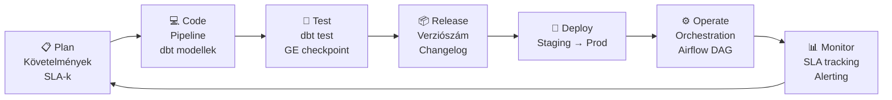
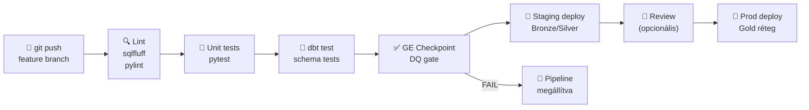
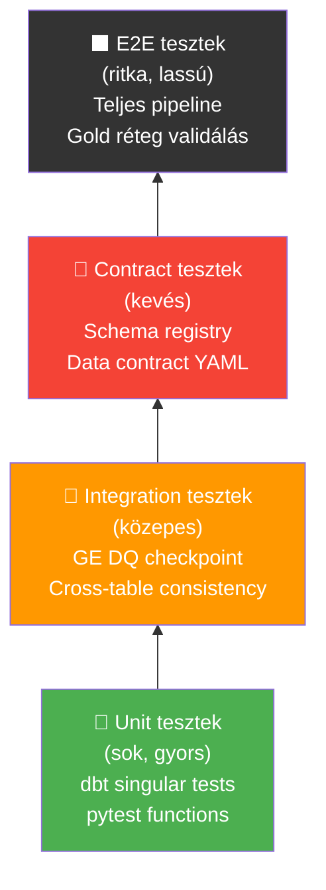

# Demo 1: DataOps és automatizáció

## Áttekintés

A DataOps a DevOps elveit alkalmazza az adatmérnöki munkára: automatizálja a pipeline-ok tesztelését, üzembe helyezését és monitorozását. Célja, hogy az adatcsapat gyorsan, megbízhatóan és reprodukálható módon tudjon adatot szállítani az üzleti felhasználóknak – hibakeresés helyett értékteremtésre fókuszálva.

!!! info "Előfeltételek"
    Docker Desktop fut. JupyterLab: **http://localhost:8888** (token: `demo`). Notebook: `demo1-dataops.ipynb`.

## Docker Compose – indítás

### 1. Környezet elindítása

```yaml title="docker-compose.yaml"
services:

  jupyter:
    image: jupyter/scipy-notebook:latest
    container_name: week06-jupyter
    ports:
      - "8888:8888"
    environment:
      JUPYTER_TOKEN: "demo"
      JUPYTER_ENABLE_LAB: "yes"
    volumes:
      - ./notebooks:/home/jovyan/work
```

```bash
docker compose up -d
```

### 2. Csomagok telepítése a notebookban

Az első notebook cellában:

```python
!pip install -q pandas pytest
```

### 3. JupyterLab megnyitása

Böngészőben: **http://localhost:8888** (token: `demo`). Nyissuk meg a `demo1-dataops.ipynb` notebookot, és futtassuk a cellákat sorban.

---

## Mi a DataOps?



A DataOps **nem egy eszköz**, hanem egy **gondolkodásmód és folyamat**: a DevOps-ból ismert elveket (verziókezelés, CI/CD, automatizált tesztelés, monitoring) alkalmazzuk az adatpipelinekre.

!!! note "DataOps ≠ DevOps"
    A szoftvermérnöki DevOps-tól két kulcspont különbözteti meg:
    - **Az adat nem kód**: a pipeline futtatása nem csak a kódtól függ – a forrásadat sémája is változhat (schema drift), az adat késve érkezhet (late data), és az adatminőség futásról futásra változhat
    - **Data contracts**: az upstream és downstream csapatok közötti szerződések nem API specifikációk, hanem adat sémák, minőségi SLA-k és frissességi garanciák

---

## DevOps vs DataOps összehasonlítás

| Szempont | DevOps | DataOps |
|----------|--------|---------|
| **Artifact** | Kód, Docker image | Adat, pipeline, séma |
| **Tesztelés** | Unit, integration, E2E | DQ gate, contract test, freshness check |
| **Versioning** | Git branch, tag | dbt model verzió, Delta table version |
| **Deployment** | Container registry → K8s | Airflow DAG → Bronze/Gold réteg |
| **Monitoring** | CPU, memória, latency | Sor szám, frissesség, DQ score |
| **Hibakód** | 500 Internal Server Error | NULL értékek, schema mismatch, late data |
| **Rollback** | Docker image régebbi verzió | Delta time travel, dbt `--select` |

---

## CI/CD for data pipelines

A CI/CD (Continuous Integration / Continuous Delivery) az adatpipelinekre alkalmazva azt jelenti, hogy **minden kódpush automatikusan tesztel és deployol** – emberi beavatkozás nélkül.



```yaml
# .github/workflows/data-pipeline-ci.yml
# GitHub Actions CI/CD – adatpipeline automatizálása

name: Data Pipeline CI

on:
  push:
    branches: [main, feature/**]
  pull_request:
    branches: [main]

jobs:
  test:
    runs-on: ubuntu-latest

    steps:
      - name: Kód letöltése
        uses: actions/checkout@v4

      - name: Python beállítása
        uses: actions/setup-python@v5
        with:
          python-version: "3.11"

      - name: Függőségek telepítése
        run: pip install -q dbt-duckdb great_expectations pandas pytest sqlfluff

      - name: SQL lint (sqlfluff)
        run: sqlfluff lint models/ --dialect duckdb

      - name: Python unit tesztek
        run: pytest tests/unit/ -v

      - name: dbt modellek buildelése és tesztelése
        run: |
          dbt deps --project-dir dbt_project/
          dbt build --project-dir dbt_project/   # run + test egyben

      - name: Great Expectations DQ gate
        run: python scripts/run_ge_checkpoint.py
        # sys.exit(1) esetén a job FAILED → merge blokkolt

  deploy-staging:
    needs: test
    runs-on: ubuntu-latest
    if: github.ref == 'refs/heads/main'

    steps:
      - name: Deploy staging rétegbe
        run: python scripts/deploy_pipeline.py --env staging
```

---

## Tesztelési piramis adatra



| Szint | Mit tesztel | Eszköz | Futási idő |
|-------|-------------|--------|-----------|
| **Unit** | Egy transzformáció logikája | `pytest`, dbt singular test | másodpercek |
| **Integration** | Adatminőség a teljes DataFrame-en | Great Expectations | percek |
| **Contract** | Upstream séma nem változott-e | Schema registry, data contract | percek |
| **E2E** | A pipeline elejétől a Gold rétegig | Teljes futtatás staging-en | tíz percek |

```python
# tests/unit/test_transformations.py
# Egyszerű Python unit tesztek a transzformációs logikához

import pytest
import pandas as pd
import sys
sys.path.insert(0, ".")
from pipeline.transformations import clean_orders, compute_daily_revenue

# Tesztadat
@pytest.fixture
def sample_orders():
    return pd.DataFrame({
        "order_id":    [1, 2, 3, None],
        "customer_id": [101, 102, None, 104],
        "amount":      [12500.0, -100.0, 8750.0, 450.0],
        "order_date":  pd.to_datetime(["2024-01-15", "2024-01-15", "2024-01-16", "2024-01-16"]),
        "status":      ["shipped", "cancelled", "shipped", "pending"],
    })

def test_clean_orders_removes_nulls(sample_orders):
    """A clean_orders kiszűri a NULL order_id-jú sorokat."""
    result = clean_orders(sample_orders)
    assert result["order_id"].notna().all(), "NULL order_id nem szűrődött ki"

def test_clean_orders_removes_negative_amounts(sample_orders):
    """A clean_orders kiszűri a negatív összegű sorokat."""
    result = clean_orders(sample_orders)
    assert (result["amount"] > 0).all(), "Negatív amount maradt az adatban"

def test_daily_revenue_aggregation(sample_orders):
    """A napi bevétel aggregáció csak a shipped státuszú rendeléseket veszi figyelembe."""
    cleaned  = clean_orders(sample_orders)
    revenue  = compute_daily_revenue(cleaned)
    # 2024-01-15: csak az 1. sor shipped → 12500.0
    jan15    = revenue[revenue["order_date"] == "2024-01-15"]["revenue"].values[0]
    assert jan15 == 12500.0, f"Várt 12500.0, kapott {jan15}"
```

---

## Observability és pipeline monitoring

Az observability a futó pipeline „megfigyelhetőségét" jelenti: tudjuk-e, hogy mi történik belül, anélkül hogy bele kellene nyúlnunk?

```python
import time
from datetime import datetime, timedelta
from typing import Optional
import pandas as pd

class PipelineMonitor:
    """
    Egyszerű pipeline SLA és freshness monitor.
    Valós rendszerben: Datadog, Grafana + Prometheus, vagy Monte Carlo.
    """

    def __init__(self, pipeline_name: str, sla_minutes: int = 60):
        self.pipeline_name = pipeline_name
        self.sla_minutes   = sla_minutes
        self._start_time: Optional[float] = None
        self.metrics: dict = {}

    # ── Futási idő mérés ──────────────────────────────────────────────────────
    def start(self):
        self._start_time = time.time()
        print(f"[{self.pipeline_name}] ▶ Indítás: {datetime.now().strftime('%H:%M:%S')}")

    def stop(self) -> float:
        elapsed = time.time() - self._start_time
        self.metrics["duration_sec"] = round(elapsed, 2)
        status = "✅" if elapsed <= self.sla_minutes * 60 else "⚠️ SLA BREACH"
        print(f"[{self.pipeline_name}] ■ Futási idő: {elapsed:.1f}s {status}")
        return elapsed

    # ── Sor szám ellenőrzés ───────────────────────────────────────────────────
    def check_row_count(self, df: pd.DataFrame, min_rows: int = 1,
                        max_rows: int = 10_000_000) -> bool:
        n = len(df)
        self.metrics["row_count"] = n
        ok = min_rows <= n <= max_rows
        icon = "✅" if ok else "❌"
        print(f"[{self.pipeline_name}] {icon} Sorok száma: {n:,} (elvárt: {min_rows:,}–{max_rows:,})")
        if not ok:
            raise RuntimeError(f"Sor szám ({n:,}) kívül esik a várt tartományon!")
        return ok

    # ── Frissesség ellenőrzés ─────────────────────────────────────────────────
    def check_freshness(self, df: pd.DataFrame, date_col: str,
                        max_age_hours: int = 25) -> bool:
        latest     = pd.to_datetime(df[date_col]).max()
        age_hours  = (datetime.now() - latest.to_pydatetime()).total_seconds() / 3600
        self.metrics["data_age_hours"] = round(age_hours, 1)
        ok   = age_hours <= max_age_hours
        icon = "✅" if ok else "❌"
        print(f"[{self.pipeline_name}] {icon} Adat kora: {age_hours:.1f}h (max SLA: {max_age_hours}h)")
        if not ok:
            raise RuntimeError(f"Adat túl régi: {age_hours:.1f}h > {max_age_hours}h SLA!")
        return ok

    def summary(self):
        print(f"\n[{self.pipeline_name}] 📊 Összefoglaló: {self.metrics}")


# Példa futtatás
df = pd.DataFrame({
    "order_id":   range(1, 4873),
    "order_date": [datetime.now() - timedelta(hours=2)] * 4872,
    "amount":     [1000.0] * 4872,
})

monitor = PipelineMonitor("orders_silver_pipeline", sla_minutes=30)
monitor.start()
time.sleep(0.1)   # szimulált futás
monitor.stop()
monitor.check_row_count(df, min_rows=1000)
monitor.check_freshness(df, date_col="order_date", max_age_hours=25)
monitor.summary()
```

---

## Data contracts – upstream–downstream megállapodás

```python
# data_contracts/orders_contract.py
# Data contract: az upstream csapat garantálja, a downstream ellenőrzi

import pandas as pd
import json
from pathlib import Path

# A contract YAML/JSON-ban definiálható – itt inline dict a demo kedvéért
ORDERS_CONTRACT = {
    "dataset":  "orders",
    "version":  "1.2.0",
    "owner":    "sales-domain-team",
    "sla": {
        "freshness_hours": 24,
        "min_rows":        1000,
    },
    "schema": {
        "order_id":    {"type": "int64",   "nullable": False, "unique": True},
        "customer_id": {"type": "int64",   "nullable": False},
        "amount":      {"type": "float64", "nullable": False, "min": 0.01},
        "status":      {"type": "object",  "nullable": False,
                        "allowed_values": ["shipped", "pending", "cancelled", "returned"]},
    }
}

def validate_contract(df: pd.DataFrame, contract: dict) -> bool:
    """Ellenőrzi, hogy a DataFrame megfelel-e a data contract-nak."""
    errors = []

    for col, rules in contract["schema"].items():
        if col not in df.columns:
            errors.append(f"Hiányzó oszlop: {col}")
            continue
        if not rules["nullable"] and df[col].isna().any():
            errors.append(f"NULL értékek: {col}")
        if rules.get("unique") and df[col].duplicated().any():
            errors.append(f"Duplikált értékek: {col}")
        if "min" in rules and (df[col] < rules["min"]).any():
            errors.append(f"Értékkülső {col} < {rules['min']}")
        if "allowed_values" in rules:
            invalid = ~df[col].isin(rules["allowed_values"])
            if invalid.any():
                errors.append(f"Érvénytelen értékek {col}: {df.loc[invalid, col].unique()}")

    if errors:
        print("❌ Data contract VIOLATED:")
        for e in errors:
            print(f"   - {e}")
        return False

    print(f"✅ Data contract OK: {contract['dataset']} v{contract['version']}")
    return True


df_test = pd.DataFrame({
    "order_id":    [1, 2, 3],
    "customer_id": [101, 102, 103],
    "amount":      [12500.0, 3200.0, 8750.0],
    "status":      ["shipped", "pending", "cancelled"],
})

validate_contract(df_test, ORDERS_CONTRACT)
```

---

## DataOps 5 automatizációs alapelve

!!! note "Az 5 alappillér"
    | Elv | Mit jelent | Eszköz |
    |-----|-----------|--------|
    | **1. Version control** | Minden kód, konfiguráció, séma gitben van | Git, dbt, Terraform |
    | **2. CI/CD** | Minden push automatikusan tesztel és deployol | GitHub Actions, GitLab CI |
    | **3. Automated testing** | Unit → integration → contract → E2E | pytest, dbt test, GE |
    | **4. Monitoring & alerting** | SLA breach, DQ romlás, late data riasztás | Datadog, Grafana, Monte Carlo |
    | **5. Collaboration** | Data contract, dokumentáció, közös DQ definíciók | DataHub, dbt docs, Confluence |

---

## Kulcsfontosságú tanulságok

- A **DataOps** nem egy szoftver, hanem a DevOps kultúra alkalmazása az adatmérnöki munkára – a cél a megbízható, gyors, automatizált adatszállítás
- A **CI/CD for data** ott válik kritikussá, ahol több csapat dolgozik ugyanazon az adatplatformon – emberi jóváhagyás helyett automatizált tesztek blokkolják a rossz minőségű kódot
- A **tesztelési piramis** (unit → integration → contract → E2E) az adatmérnöki kontextusban konkrétan: pytest + dbt test + GE checkpoint + staging deploy
- A **data contract** az upstream csapat ígérete a downstream csapatnak – ha séma változik, a contract frissítése kötelező; a CI/CD automatikusan ellenőrzi
- Az **observability** (futási idő, sorszám, frissesség) nélkül csak akkor derül ki a hiba, ha az üzleti felhasználó panaszkodik – a monitoring célja, hogy mi értesüljünk elsőként

## Kapcsolódó anyagok

- Demo 2 – Adatmenedzsment (Data Governance és DataOps összefüggése)
- Demo 5 – Adatminőség alapok (DQ gate a DataOps tesztelési rétegében)
- Demo 6 – Great Expectations (a CI/CD DQ gate implementációja)
- Labor 05 – Orchestration (Airflow a DataOps „Operate" fázisában)

## Kapcsolódó notebook

`work/demo1-dataops.ipynb`
