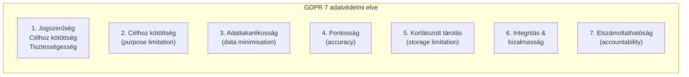
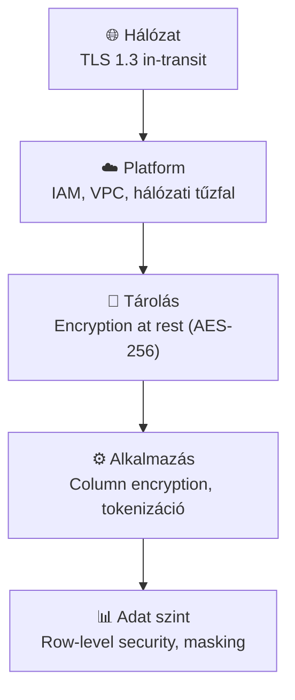
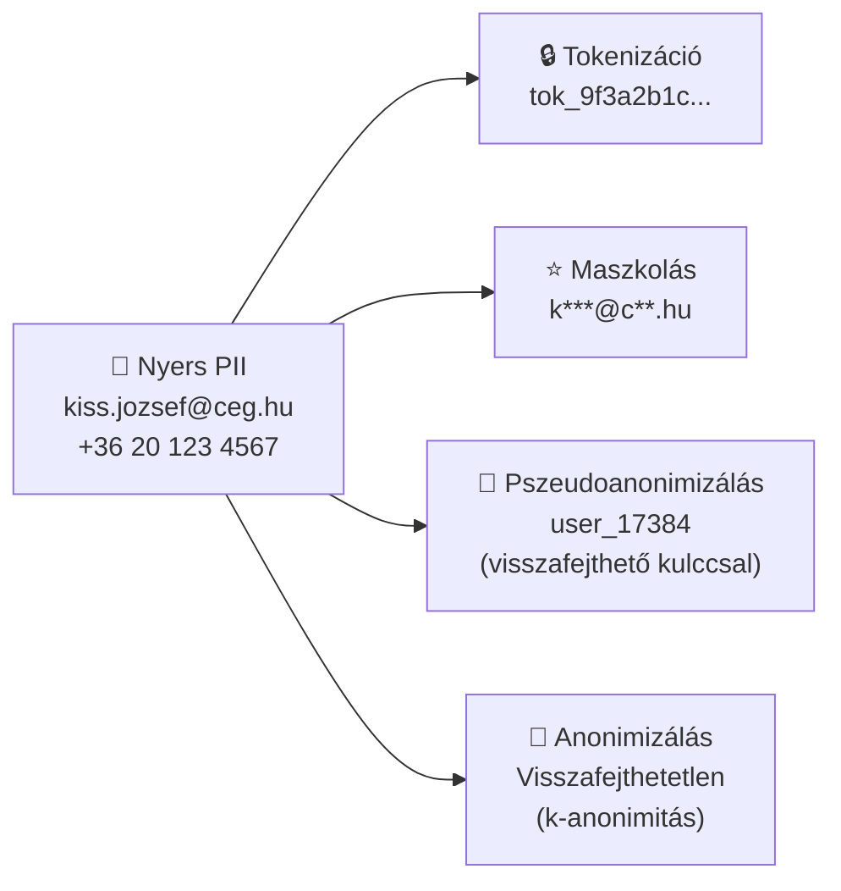

# Demo 4: Adatbiztonság

## Áttekintés

Az adatbiztonság az adat bizalmasságának (confidentiality), sértetlenségének (integrity) és rendelkezésre állásának (availability) – a CIA-triád – biztosítása. Az adatmérnököknek nem elég a pipeline-t üzembe helyezni: gondoskodniuk kell arról, hogy az adatok ne kerüljenek illetéktelen kezekbe, ne sérüljenek, és ne vesszenek el.

!!! info "Előfeltételek"
    Docker Desktop fut. JupyterLab: **http://localhost:8888** (token: `demo`). PostgreSQL: `localhost:5432` (user: `labor`, pass: `labor`, db: `security_demo`). Notebook: `demo4-adatbiztonsag.ipynb`.

## Docker Compose – indítás

### 1. Környezet elindítása

```yaml title="docker-compose.yaml"
services:

  postgres:
    image: postgres:16
    container_name: week06-postgres
    environment:
      POSTGRES_USER: labor
      POSTGRES_PASSWORD: labor
      POSTGRES_DB: security_demo
    ports:
      - "5432:5432"
    healthcheck:
      test: ["CMD-SHELL", "pg_isready -U labor -d security_demo"]
      interval: 10s
      timeout: 5s
      retries: 5

  jupyter:
    image: jupyter/scipy-notebook:latest
    container_name: week06-jupyter
    depends_on:
      postgres:
        condition: service_healthy
    ports:
      - "8888:8888"
    environment:
      JUPYTER_TOKEN: "demo"
      JUPYTER_ENABLE_LAB: "yes"
    volumes:
      - ./notebooks:/home/jovyan/work
```

```bash
docker compose up -d
```

### 2. Csomagok telepítése a notebookban

Az első notebook cellában:

```python
!pip install -q pandas cryptography duckdb sqlalchemy psycopg2-binary
```

### 3. JupyterLab megnyitása

Böngészőben: **http://localhost:8888** (token: `demo`). Nyissuk meg a `demo4-adatbiztonsag.ipynb` notebookot, és futtassuk a cellákat sorban.

---

## Adatbiztonság az adatmérnöki életciklusban

A biztonság nem egyetlen réteg – az adatmérnöki életciklus **minden fázisában** más-más védelmi teendők vannak.

```mermaid
graph LR
    subgraph Ingest["📥 Ingest"]
        I1["TLS in-transit"]
        I2["PII detektálás\n(regex, NER)"]
        I3["Schema validáció\n(contract check)"]
    end
    subgraph Store["💾 Store"]
        S1["Encryption at rest\n(AES-256, S3 SSE)"]
        S2["Access control\n(IAM, bucket policy)"]
        S3["Backup / retention\npolicy"]
    end
    subgraph Transform["⚙️ Transform"]
        T1["Column encryption\n(Fernet, KMS)"]
        T2["Masking /\npszeudoanonimizálás"]
        T3["Audit log\n(ki, mikor, mit)"]
    end
    subgraph Serve["📊 Serve"]
        V1["RBAC / ABAC\n(szerepkör alapú)"]
        V2["Row-level security\n(region, tenant)"]
        V3["Export control\n(DLP, watermarking)"]
    end

    Ingest --> Store --> Transform --> Serve
```



| Fázis | Fő kockázat | Adatmérnöki védekezés |
|-------|------------|----------------------|
| **Ingest** | Lehallgatás, sémasérülés | TLS 1.3, PII scan, contract validation |
| **Store** | Fizikai lopás, jogosulatlan hozzáférés | AES-256, IAM policy, bucket versioning |
| **Transform** | PII szétterjedés a pipeline-ban | Column encryption, masking, audit log |
| **Serve** | Jogosulttalan lekérdezés | RBAC, row-level security, export monitoring |

!!! warning "Privacy by Design (GDPR Art. 25)"
    A biztonságot a pipeline tervezésekor kell beépíteni – nem utólag. Ha a Bronze rétegbe PII kerül, az összes downstream lépésben is kezelni kell. Sokkal egyszerűbb az ingestionkor dönteni: titkosítjuk, maszkoljuk vagy kizárjuk a PII mezőt.

## GDPR alapok adatmérnöki szemmel

A GDPR (General Data Protection Regulation, 2018/GDPR EU rendelet) az EU adatvédelmi szabályozása. Adatmérnöki szempontból a legfontosabb kötelezettségeket határozza meg személyes adatok (PII) kezelésére.



!!! warning "PII a pipeline-ban – adatmérnöki felelősség"
    | GDPR fogalom | Adatmérnöki teendő |
    |-------------|-------------------|
    | **Személyes adat** (PII) | Azonosítás: email, telefonszám, IP-cím, cookie, helyadat |
    | **Adattakarékosság** | Csak a szükséges mezőket tároljuk a pipeline-ban |
    | **Korlátozott tárolás** | Adatmegőrzési szabályzat + automatikus törlés (retention policy) |
    | **Hozzáférési jog** | Ügyfél kérhet adatkivonatot → a pipeline-nak támogatnia kell a lookup-ot |
    | **Törlési jog (right to be forgotten)** | Az ügyfél kérhet törlést → ha a Bronze rétegben is van PII, az is törlendő |
    | **Adatfeldolgozó vs adatkezelő** | A felhőszolgáltató (AWS, GCP) adatfeldolgozó – DPA szerződés szükséges |

## Titkosítás rétegei



| Réteg | Technológia | Mit véd |
|-------|-------------|---------|
| **In-transit** | TLS 1.3, mTLS | Hálózaton átmenő adat lehallgatás ellen |
| **At-rest** | AES-256 (S3 SSE, LUKS) | Disk/tároló ellopás ellen |
| **Column encryption** | AES-GCM + KMS | Adatbázisban tárolt érzékeny mezők (pl. CCN) |
| **Tokenizáció** | Format-preserving encryption | PII helyettesítése kereshető tokennel |
| **KMS** | AWS KMS, HashiCorp Vault | Kulcskezelés – a kulcs soha nem kerül az adattal együtt tárolásra |

```python
from cryptography.fernet import Fernet
import base64, hashlib

# Szimmetrikus titkosítás demonstráció (Fernet = AES-128-CBC + HMAC)
# Valós rendszerben: AWS KMS vagy HashiCorp Vault tárolja a kulcsot

def generate_key(passphrase: str) -> bytes:
    """Determinisztikus kulcs generálása jelszóból (demo célra – valóban ne így!)."""
    key = hashlib.sha256(passphrase.encode()).digest()
    return base64.urlsafe_b64encode(key)

class ColumnEncryptor:
    """Oszlopszintű titkosítás pandas DataFrame-hez."""

    def __init__(self, passphrase: str):
        self.cipher = Fernet(generate_key(passphrase))

    def encrypt_column(self, series):
        return series.apply(
            lambda v: self.cipher.encrypt(str(v).encode()).decode() if pd.notna(v) else v
        )

    def decrypt_column(self, series):
        return series.apply(
            lambda v: self.cipher.decrypt(v.encode()).decode() if pd.notna(v) else v
        )

import pandas as pd

df = pd.DataFrame({
    "order_id":    [1, 2, 3],
    "customer_id": [101, 102, 103],
    "email":       ["kiss.jozsef@ceg.hu", "nagy.maria@mail.com", "toth.peter@example.org"],
    "amount":      [12500.0, 3200.0, 8750.0],
})

enc = ColumnEncryptor("titkos_kulcs_2024")

# Csak az email mező kerül titkosításra – a többi mező plaintext marad
df_encrypted = df.copy()
df_encrypted["email"] = enc.encrypt_column(df["email"])

print("=== Titkosított DataFrame ===")
print(df_encrypted.to_string(index=False))

df_decrypted = df_encrypted.copy()
df_decrypted["email"] = enc.decrypt_column(df_encrypted["email"])
print("\n=== Visszafejtett DataFrame ===")
print(df_decrypted.to_string(index=False))
```

## Adatmaszkolás és anonimizálás

A maszkolás és anonimizálás célja: az éles adatokhoz hasonló, de személyazonosításra alkalmatlan adatok előállítása (tesztelés, fejlesztés, analitika).



| Módszer | Visszafejthető? | GDPR hatálya alá esik? | Felhasználás |
|---------|----------------|----------------------|-------------|
| **Titkosítás** | Igen (kulccsal) | Igen | Tárolás |
| **Tokenizáció** | Igen (lookup tábla) | Igen | Pipeline közbenső lépés |
| **Pszeudoanonimizálás** | Igen (kulccsal) | Igen | Fejlesztői adatbázis |
| **Anonimizálás** | Nem | Nem | Analitika, kutatás |

```python
import re
import pandas as pd
import hashlib

class DataMasker:
    """PII maszkolás adatmérnöki pipeline-okhoz."""

    @staticmethod
    def mask_email(email: str) -> str:
        """kiss.jozsef@ceg.hu → k***@c**.hu"""
        if not email or "@" not in email:
            return email
        local, domain = email.split("@", 1)
        masked_local  = local[0] + "***"
        domain_parts  = domain.split(".")
        masked_domain = domain_parts[0][0] + "**"
        return f"{masked_local}@{masked_domain}.{domain_parts[-1]}"

    @staticmethod
    def mask_phone(phone: str) -> str:
        """+36 20 123 4567 → +36 ** *** 4567"""
        digits = re.sub(r"\D", "", phone)
        return "*" * (len(digits) - 4) + digits[-4:]

    @staticmethod
    def pseudonymize(value: str, salt: str = "secret_salt") -> str:
        """Visszafejthető (lookup tábla alapján) pszeudoanonimizálás."""
        return "uid_" + hashlib.sha256(f"{salt}{value}".encode()).hexdigest()[:12]

    @staticmethod
    def generalize_age(age: int, bucket_size: int = 10) -> str:
        """27 → '20-29' – k-anonimitási technika"""
        lo = (age // bucket_size) * bucket_size
        return f"{lo}-{lo + bucket_size - 1}"

# Példa alkalmazás
df = pd.DataFrame({
    "name":  ["Kiss József", "Nagy Mária", "Tóth Péter"],
    "email": ["kiss.jozsef@ceg.hu", "nagy.maria@mail.com", "toth.peter@example.org"],
    "phone": ["+36201234567", "+36301234568", "+36701234569"],
    "age":   [27, 34, 51],
})

masker = DataMasker()
df_masked = df.copy()
df_masked["email"]  = df["email"].apply(masker.mask_email)
df_masked["phone"]  = df["phone"].apply(masker.mask_phone)
df_masked["name"]   = df["name"].apply(lambda x: masker.pseudonymize(x))
df_masked["age"]    = df["age"].apply(masker.generalize_age)

print("=== Maszkolás eredménye ===")
print(df_masked.to_string(index=False))
```

## Hozzáférés-vezérlés

### RBAC és ABAC

| Modell | Felépítés | Előny | Hátrány |
|--------|-----------|-------|---------|
| **RBAC** (Role-Based) | Felhasználó → Szerepkör → Jogosultság | Egyszerű, jól auditálható | Rugalmatlan, szerepkör-robbanás |
| **ABAC** (Attribute-Based) | Felhasználó attribútumai + kontextus → Policy | Rugalmas, fine-grained | Komplex policy menedzsment |

### DuckDB row- és column-level security

```python
import duckdb

# DuckDB in-process demo: sor- és oszlopszintű hozzáférés-vezérlés
# Valós rendszerben: PostgreSQL RLS, BigQuery column-level security, Snowflake row access policy

con = duckdb.connect()

# Tesztadat feltöltése
con.execute("""
    CREATE TABLE orders AS SELECT * FROM (VALUES
        (1, 101, 'EU', 12500.0, 'sales@ceg.hu'),
        (2, 102, 'US', 3200.0,  'b2b@ceg.hu'),
        (3, 103, 'EU', 8750.0,  'sales@ceg.hu'),
        (4, 104, 'APAC', 45000.0, 'apac@ceg.hu')
    ) AS t(order_id, customer_id, region, amount, contact_email)
""")

def query_as_role(role: str, region_filter: str = None) -> pd.DataFrame:
    """
    Szerepkör alapú nézet szimulálása:
    - 'analyst': csak EU régió, nincs email mező
    - 'manager': minden régió, nincs email mező
    - 'admin': minden adat
    """
    if role == "analyst":
        # Column-level: email ki van takarva; Row-level: csak EU
        return con.execute("""
            SELECT order_id, customer_id, region, amount, '***' AS contact_email
            FROM orders WHERE region = 'EU'
        """).df()
    elif role == "manager":
        # Column-level: email rejtett; minden region
        return con.execute("""
            SELECT order_id, customer_id, region, amount, '***' AS contact_email
            FROM orders
        """).df()
    else:  # admin
        return con.execute("SELECT * FROM orders").df()

print("=== analyst szerepkör (csak EU, email nélkül) ===")
print(query_as_role("analyst").to_string(index=False))

print("\n=== admin szerepkör (teljes hozzáférés) ===")
print(query_as_role("admin").to_string(index=False))
```

## Auditálás és megfelelőség

```python
import json
from datetime import datetime
from typing import Optional

class AuditLogger:
    """
    Egyszerű audit log implementáció.
    Valós rendszerben: AWS CloudTrail, GCP Audit Logs, vagy Elasticsearch.
    """

    def __init__(self, log_file: str = "/tmp/audit.log"):
        self.log_file = log_file

    def log(self, user: str, action: str, resource: str,
            outcome: str = "SUCCESS", details: Optional[dict] = None):
        entry = {
            "timestamp":  datetime.utcnow().isoformat() + "Z",
            "user":       user,
            "action":     action,     # READ, WRITE, DELETE, EXPORT
            "resource":   resource,   # tábla neve, fájl útvonala
            "outcome":    outcome,    # SUCCESS, DENIED, ERROR
            "details":    details or {}
        }
        with open(self.log_file, "a") as f:
            f.write(json.dumps(entry, ensure_ascii=False) + "\n")
        return entry

# Példa audit bejegyzések
logger = AuditLogger()

entries = [
    logger.log("kiss.jozsef", "READ",   "orders",   "SUCCESS", {"rows": 4872, "filter": "region=EU"}),
    logger.log("valaki",      "EXPORT", "customers","DENIED",  {"reason": "no export permission"}),
    logger.log("etl_service", "WRITE",  "gold.daily_revenue", "SUCCESS", {"rows_written": 365}),
]

print("=== Audit napló ===")
for e in entries:
    print(f"[{e['timestamp']}] {e['user']:15s} {e['action']:8s} {e['resource']:25s} → {e['outcome']}")
```

!!! warning "GDPR és audit log"
    Az audit log maga is személyes adatot tartalmazhat (felhasználónév, IP-cím). A GDPR minimalizáció elve alapján: csak azt naplózzuk, ami a biztonság/megfelelőség szempontjából szükséges, és a logokat is adatmegőrzési szabályzat alá kell vonni.

## Kulcsfontosságú tanulságok

- A **CIA-triád** (Confidentiality, Integrity, Availability) az adatbiztonság alapja – mindhárom dimenzióban gondoskodni kell a védelemről
- A **GDPR adatmaszkolás** nem opcionális: ha PII adat kerül a pipeline-ba, azonnal döntsük el, hogy titkosítjuk, maszkobjuk vagy pszeudoanonimizáljuk
- A **Column/Row-level security** az adatbázis szintjén a leghatékonyabb: nem az alkalmazás felelős a szűrésért, hanem az adatbázis motor
- A **least-privilege elv** alapján minden service account és felhasználó csak annyi jogosultságot kap, amennyire feltétlenül szükség van
- Az **audit log** a megfelelőség (compliance) bizonyítékát adja: ki, mikor, mihez fért hozzá – GDPR kötelezi az adatkezelőket az elszámoltathatóságra

## Kapcsolódó anyagok

- Demo 2 – Adatmenedzsment (Data Governance keretrendszer)
- Demo 5 – Adatminőség (az integritás a DQ egyik dimenziója)
- `week06-kerdesek.md` – GDPR kérdések a ZH-hoz

## Kapcsolódó notebook

`work/demo4-adatbiztonsag.ipynb`
