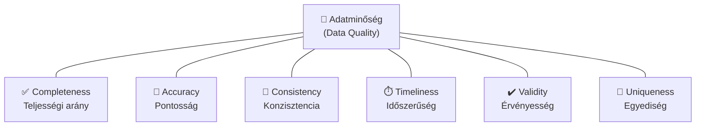
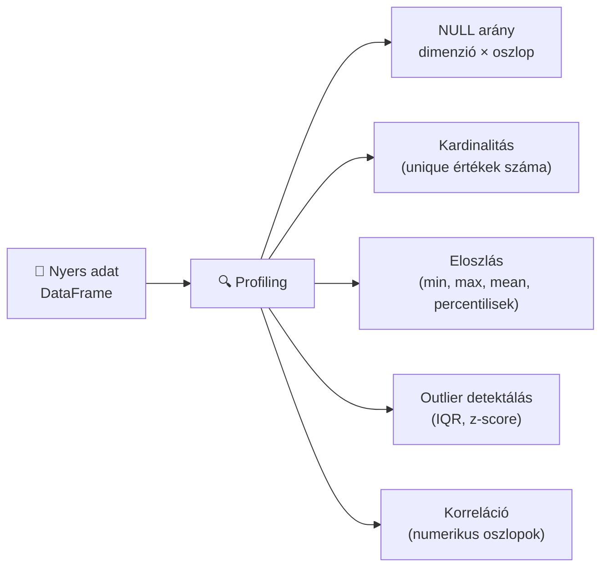
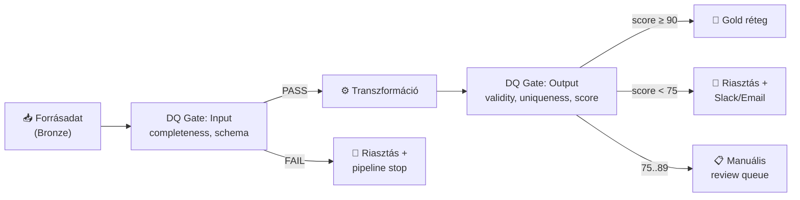

# Demo 5: Adatminőség alapok

## Áttekintés

Az adatminőség (Data Quality, DQ) az adatok „fitnesz for use" mértéke – azt méri, mennyire alkalmasak az adatok az adott üzleti célra. A rossz minőségű adat döntéshibákhoz, GDPR-jogsértésekhez és elveszett bevételhez vezet. Az adatmérnök feladata: a minőséget **mérni**, **monitorozni** és **kikényszeríteni** a pipeline-ban.

!!! info "Előfeltételek"
    Docker Desktop fut. JupyterLab: **http://localhost:8888** (token: `demo`). Notebook: `demo5-adatminoseg.ipynb`.

## Docker Compose – indítás

### 1. Környezet elindítása

```yaml title="docker-compose.yaml"
services:

  jupyter:
    image: jupyter/scipy-notebook:latest
    container_name: week06-jupyter
    ports:
      - "8888:8888"
    environment:
      JUPYTER_TOKEN: "demo"
      JUPYTER_ENABLE_LAB: "yes"
    volumes:
      - ./notebooks:/home/jovyan/work
```

```bash
docker compose up -d
```

### 2. Csomagok telepítése a notebookban

Az első notebook cellában:

```python
!pip install -q pandas numpy ydata-profiling
```

### 3. JupyterLab megnyitása

Böngészőben: **http://localhost:8888** (token: `demo`). Nyissuk meg a `demo5-adatminoseg.ipynb` notebookot, és futtassuk a cellákat sorban.

---

## Az adatminőség 6 dimenziója



| Dimenzió | Definíció | Mérőszám | Példa probléma |
|----------|-----------|----------|---------------|
| **Completeness** | Az értékek hány %-a nem NULL | `1 - null_count / total_count` | `customer_email` 12%-a NULL |
| **Accuracy** | Az adat egyezik a valósággal | Referencia adattal való egyezés % | Irányítószám nem létező értéket tartalmaz |
| **Consistency** | Különböző helyeken ugyanaz az érték | Cross-table match rate | `orders.customer_id` 3%-a nem szerepel `customers.id`-ban |
| **Timeliness** | Az adat elég friss a felhasználáshoz | `now() - max(updated_at)` | A napi riport 26 órás adaton alapul |
| **Validity** | Az adat megfelel a definiált szabályoknak | Szabályszegések aránya | Negatív `amount`, jövőbeli `birth_date` |
| **Uniqueness** | Nincs duplikált sor | `1 - duplicate_count / total_count` | `order_id` 0.8%-a duplikált |

!!! note "Miért épp ez a 6?"
    Az ISO 8000 és a DAMA-DMBOK is ezt a 6 dimenziót ajánlja mint minimális alapkészlet. Egyes szervezetek bővítik (pl. **Lineage** – az adat eredete igazolható-e), de a hat dimenzió együttese elég a legtöbb üzleti és megfelelőségi követelmény kielégítéséhez.

## Adatprofiling

Az adatprofiling automatikusan feltárja az adatset statisztikáit – az első lépés minden DQ folyamatban.



```python
import pandas as pd
import numpy as np

# Minta adatset – rendelések PII-vel és minőségi hibákkal
df = pd.DataFrame({
    "order_id":    [1, 2, 2, 4, 5, 6, 7, 8, 9, 10],       # duplikált: 2
    "customer_id": [101, 102, 102, None, 105, 106, None, 108, 109, 110],
    "amount":      [12500, 3200, 3200, 8750, -100, 99999, 450, 0, 15000, 7300],
    "order_date":  ["2024-01-15", "2024-01-16", "2024-01-16", "2024-01-17",
                    "2025-12-31",  # jövőbeli dátum!
                    "2024-01-18", "2024-01-19", "2024-01-20", "2024-01-21", "2024-01-22"],
    "status":      ["shipped", "pending", "pending", "shipped", "cancelled",
                    "SHIPPED",  # inkonzisztens formátum
                    "pending", "shipped", "shipped", "cancelled"],
    "email":       ["a@b.hu", None, None, "c@d.hu", "nem_email",  # érvénytelen
                    "e@f.hu", "g@h.hu", None, "i@j.hu", "k@l.hu"],
})

def profile_dataframe(df: pd.DataFrame) -> pd.DataFrame:
    """Gyors adatprofil: NULL arány, kardinalitás, alaptípus minden oszlopra."""
    rows = []
    for col in df.columns:
        null_count  = df[col].isna().sum()
        unique_vals = df[col].nunique(dropna=True)
        sample_vals = df[col].dropna().unique()[:3].tolist()
        row = {
            "oszlop":       col,
            "dtype":        str(df[col].dtype),
            "null_db":      null_count,
            "null_%":       round(null_count / len(df) * 100, 1),
            "egyedi_érték": unique_vals,
            "minta":        sample_vals,
        }
        if pd.api.types.is_numeric_dtype(df[col]):
            row["min"]  = df[col].min()
            row["max"]  = df[col].max()
            row["mean"] = round(df[col].mean(), 2)
        rows.append(row)
    return pd.DataFrame(rows)

print("=== Adatprofil ===")
profile = profile_dataframe(df)
print(profile[["oszlop", "null_%", "egyedi_érték", "min", "max"]].to_string(index=False))
```

## DQ metrikák számítása

```python
import re
from datetime import date

class DQMetrics:
    """
    Az adatminőség 6 dimenziójának mérése pandas DataFrame-en.
    Valós rendszerben: Great Expectations vagy dbt tests futtatja ezeket.
    """

    def __init__(self, df: pd.DataFrame):
        self.df = df
        self.n  = len(df)

    # ── Completeness ─────────────────────────────────────────────────────────
    def completeness(self, col: str) -> float:
        """Nem-NULL értékek aránya [0..1]."""
        return 1 - self.df[col].isna().mean()

    # ── Validity ─────────────────────────────────────────────────────────────
    def validity_amount_positive(self) -> float:
        """Az amount mező hány %-a pozitív?"""
        valid = (self.df["amount"] > 0).sum()
        return valid / self.n

    def validity_email_format(self, col: str = "email") -> float:
        """Hány %-a érvényes e-mail cím regex alapján?"""
        pattern = r"^[a-zA-Z0-9._%+\-]+@[a-zA-Z0-9.\-]+\.[a-zA-Z]{2,}$"
        non_null = self.df[col].dropna()
        valid    = non_null.apply(lambda v: bool(re.match(pattern, str(v)))).sum()
        return valid / self.n  # a NULL-okat hibának számítjuk

    def validity_date_not_future(self, col: str = "order_date") -> float:
        """Hány %-a nem jövőbeli dátum?"""
        today  = pd.Timestamp(date.today())
        parsed = pd.to_datetime(self.df[col], errors="coerce")
        valid  = (parsed <= today).sum()
        return valid / self.n

    # ── Uniqueness ───────────────────────────────────────────────────────────
    def uniqueness(self, col: str) -> float:
        """Egyedi értékek aránya (duplikáció mértéke)."""
        dup_count = self.df[col].duplicated(keep=False).sum()
        return 1 - dup_count / self.n

    # ── Consistency ──────────────────────────────────────────────────────────
    def consistency_status_values(self, col: str = "status",
                                  allowed: set = None) -> float:
        """Hány sor tartalmaz engedélyezett értéket az adott oszlopban?"""
        if allowed is None:
            allowed = {"shipped", "pending", "cancelled"}
        valid = self.df[col].str.lower().isin(allowed).sum()
        return valid / self.n

    # ── Timeliness ───────────────────────────────────────────────────────────
    def timeliness_hours(self, col: str = "order_date",
                          sla_hours: int = 24) -> float:
        """Az adatok hány %-a SLA-n belül frissült (szimulált)."""
        # Demo: minden sor adat frissessége véletlenszerű 0-48h között
        rng        = np.random.default_rng(42)
        delays     = rng.uniform(0, 48, size=self.n)
        on_time    = (delays <= sla_hours).sum()
        return on_time / self.n


metrics = DQMetrics(df)

results = {
    "completeness_customer_id": metrics.completeness("customer_id"),
    "completeness_email":       metrics.completeness("email"),
    "validity_amount_positive": metrics.validity_amount_positive(),
    "validity_email_format":    metrics.validity_email_format(),
    "validity_date_not_future": metrics.validity_date_not_future(),
    "uniqueness_order_id":      metrics.uniqueness("order_id"),
    "consistency_status":       metrics.consistency_status_values(),
    "timeliness_24h":           metrics.timeliness_hours(),
}

print("=== DQ Metrikák ===")
for k, v in results.items():
    bar = "█" * int(v * 20) + "░" * (20 - int(v * 20))
    print(f"  {k:35s} {bar} {v*100:5.1f}%")
```

## DQ scoring – összesített pontszám

```python
def compute_dq_score(metric_results: dict, weights: dict = None) -> float:
    """
    Súlyozott DQ score számítása [0..100].

    Minden metrika 0..1 értéket vesz fel (1 = tökéletes).
    A súlyok összege 1-re kell normalizálni – ha nincs megadva, egyenlő súlyt kapnak.
    """
    if weights is None:
        n = len(metric_results)
        weights = {k: 1 / n for k in metric_results}

    score = sum(metric_results[k] * weights.get(k, 0) for k in metric_results)
    return round(score * 100, 2)


# Üzleti fontosság alapú súlyok
weights = {
    "completeness_customer_id": 0.20,   # kritikus JOIN kulcs
    "completeness_email":       0.10,
    "validity_amount_positive": 0.20,   # pénzügyi adat
    "validity_email_format":    0.10,
    "validity_date_not_future": 0.15,
    "uniqueness_order_id":      0.15,   # PK egyediség
    "consistency_status":       0.05,
    "timeliness_24h":           0.05,
}

score = compute_dq_score(results, weights)
print(f"\n=== DQ Score: {score}/100 ===")

if score >= 90:
    print("🟢 Elfogadható minőség – Gold rétegbe engedhető")
elif score >= 75:
    print("🟡 Figyelem – javítás ajánlott, Silver szinten tartandó")
else:
    print("🔴 Nem megfelelő minőség – pipeline megállítva, riasztás küldve")
```

## DQ monitoring beépítése a pipeline-ba



```python
class DQPipelineGate:
    """
    DQ kapu a Bronze→Silver és Silver→Gold átmeneteken.
    Ha a minőség nem megfelelő, kivételt dob – az Airflow task FAILED lesz.
    """

    def __init__(self, threshold_warn: float = 75.0, threshold_stop: float = 60.0):
        self.threshold_warn = threshold_warn
        self.threshold_stop = threshold_stop

    def run(self, df: pd.DataFrame, stage: str = "silver") -> float:
        m = DQMetrics(df)
        res = {
            "completeness": m.completeness("customer_id"),
            "validity":     m.validity_amount_positive(),
            "uniqueness":   m.uniqueness("order_id"),
            "consistency":  m.consistency_status_values(),
        }
        score = compute_dq_score(res)

        print(f"[DQ Gate / {stage}] Score: {score}/100")
        if score < self.threshold_stop:
            raise RuntimeError(
                f"DQ Gate FAILED ({stage}): score {score} < {self.threshold_stop}. "
                "Pipeline megállítva."
            )
        if score < self.threshold_warn:
            print(f"⚠️  DQ Gate WARNING ({stage}): score {score} – review szükséges")
        else:
            print(f"✅ DQ Gate PASSED ({stage}): adat továbbítható")
        return score


gate = DQPipelineGate()
gate.run(df, stage="silver")
```

## Kulcsfontosságú tanulságok

- Az adatminőség **6 dimenziója** (Completeness, Accuracy, Consistency, Timeliness, Validity, Uniqueness) egymást kiegészítő mérőszámokat alkot – mind a 6 szükséges a teljes képhez
- Az **adatprofiling** nem egyszeri feladat, hanem folyamatos monitor: minden betöltés után fusson automatikusan, hogy az anomáliák azonnal látszódjanak
- A **DQ score** egy összesített, súlyozott mutató – az üzleti prioritásnak megfelelően kell a súlyokat beállítani (pl. pénzügyi adat validitása fontosabb, mint a megjegyzés mező teljessége)
- A **DQ kapu** (gate) a pipeline-ban dönt: PASS → továbbmegy az adat; WARN → figyelmeztetés, de továbbenged; FAIL → pipeline megállítás és riasztás
- A **Great Expectations** (Demo 6) ezt a folyamatot teszi deklaratív módon kezelhetővé: a DQ szabályokat kód helyett YAML-ban/Python-ban definiáljuk, és automatikusan dokumentálódnak

## Kapcsolódó anyagok

- Demo 6 – Great Expectations (DQ gate ipari megoldása)
- Demo 2 – Adatmenedzsment (DQ a DAMA-DMBOK 11. tudásterülete)
- Demo 4 – Adatbiztonság (az accuracy és integrity a CIA-triád része)
- `week06-kerdesek.md` – DQ dimenzió kérdések a ZH-hoz

## Kapcsolódó notebook

`work/demo5-adatminoseg.ipynb`
