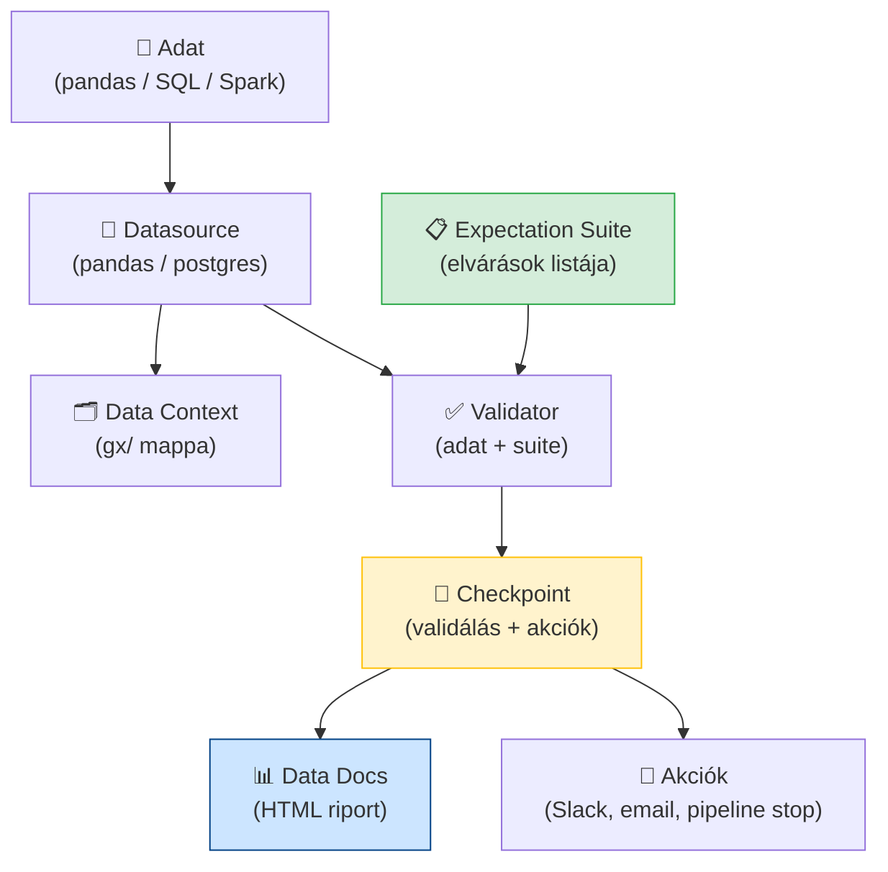
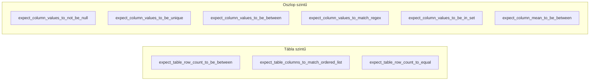

# Demo 6: Great Expectations

## Áttekintés

A **Great Expectations (GE)** a legnépszerűbb nyílt forráskódú adat-validációs keretrendszer. Deklaratív módon – Python kódban vagy YAML-ban – definiáljuk, hogy az adatnak milyennek *kell* lennie (expectation), majd a GE ellenőrzi és HTML riportot generál (Data Docs). Az Airflow-val integrálva automatikus DQ kaput alkot a pipeline-ban.

!!! info "Előfeltételek"
    Docker Desktop fut. JupyterLab: **http://localhost:8888** (token: `demo`). PostgreSQL: `localhost:5432` (user: `labor`, pass: `labor`, db: `ge_demo`). Notebook: `demo6-great-expectations.ipynb`. A kódblokkok sorban futtatandók – az állapot a `gx/` mappában perzisztál.

## Docker Compose – indítás

### 1. Környezet elindítása

```yaml title="docker-compose.yaml"
services:

  postgres:
    image: postgres:16
    container_name: week06-postgres
    environment:
      POSTGRES_USER: labor
      POSTGRES_PASSWORD: labor
      POSTGRES_DB: ge_demo
    ports:
      - "5432:5432"
    healthcheck:
      test: ["CMD-SHELL", "pg_isready -U labor -d ge_demo"]
      interval: 10s
      timeout: 5s
      retries: 5

  jupyter:
    image: jupyter/scipy-notebook:latest
    container_name: week06-jupyter
    depends_on:
      postgres:
        condition: service_healthy
    ports:
      - "8888:8888"
    environment:
      JUPYTER_TOKEN: "demo"
      JUPYTER_ENABLE_LAB: "yes"
    volumes:
      - ./notebooks:/home/jovyan/work
```

```bash
docker compose up -d
```

### 2. Csomagok telepítése a notebookban

Az első notebook cellában:

```python
!pip install -q great_expectations pandas pyarrow sqlalchemy psycopg2-binary
```

### 3. JupyterLab megnyitása

Böngészőben: **http://localhost:8888** (token: `demo`). Nyissuk meg a `demo6-great-expectations.ipynb` notebookot, és futtassuk a cellákat sorban.

---

## GE architektúra



| Fogalom | Szerep |
|---------|--------|
| **Data Context** | A GE projekt gyökere (`gx/` mappa); tárolja a konfigurációt |
| **Datasource** | Adatforrás leíró (pandas DataFrame, PostgreSQL, Spark) |
| **Expectation Suite** | Elvárások gyűjteménye (pl. „az email mező ne legyen NULL") |
| **Validator** | Az adat és a suite összekapcsolása; futtatja az ellenőrzéseket |
| **Checkpoint** | Előre definiált validálási + akció folyamat (CI/CD-be illeszthető) |
| **Data Docs** | Automatikusan generált HTML riport az elvárásokról és eredményekről |

## Expectation típusok



## GE Data Context inicializálás

```python
# ge_setup.py
import great_expectations as gx
import pandas as pd

# Data Context létrehozása (első futáskor létrehozza a gx/ mappát)
context = gx.get_context(mode="file")          # gx/ a munkakönyvtárban

# Pandas datasource hozzáadása
datasource = context.sources.add_or_update_pandas(name="orders_source")

# Adat asset definiálása (a DataFrame neve, amelyen validálunk)
data_asset = datasource.add_dataframe_asset(name="orders_df")

print("✅ Data Context inicializálva")
print(f"   Projekt mappa: {context.root_directory}")
```

## Expectation Suite definiálása

```python
# ge_suite.py
import great_expectations as gx
import pandas as pd

context = gx.get_context(mode="file")

SUITE_NAME = "orders_quality_suite"

# Suite létrehozás (ha már létezik, felülírjuk)
suite = context.add_or_update_expectation_suite(expectation_suite_name=SUITE_NAME)

# ── Teszt adat ────────────────────────────────────────────────────────────────
df_valid = pd.DataFrame({
    "order_id":    [1, 2, 3, 4, 5],
    "customer_id": [101, 102, 103, 104, 105],
    "amount":      [12500.0, 3200.0, 8750.0, 450.0, 15000.0],
    "status":      ["shipped", "pending", "shipped", "cancelled", "shipped"],
    "email":       ["a@b.hu", "c@d.hu", "e@f.hu", "g@h.hu", "i@j.hu"],
    "order_date":  pd.to_datetime(["2024-01-15", "2024-01-16",
                                   "2024-01-17", "2024-01-18", "2024-01-19"]),
})

datasource = context.get_datasource("orders_source")
data_asset = datasource.get_asset("orders_df")
batch_request = data_asset.build_batch_request(dataframe=df_valid)

validator = context.get_validator(
    batch_request=batch_request,
    expectation_suite_name=SUITE_NAME,
)

# ── Tábla szintű elvárások ────────────────────────────────────────────────────
validator.expect_table_row_count_to_be_between(min_value=1, max_value=10_000_000)
validator.expect_table_columns_to_match_ordered_list(
    column_list=["order_id", "customer_id", "amount", "status", "email", "order_date"]
)

# ── Oszlop szintű elvárások ───────────────────────────────────────────────────
# Completeness
validator.expect_column_values_to_not_be_null("order_id")
validator.expect_column_values_to_not_be_null("customer_id")
validator.expect_column_values_to_not_be_null("amount")

# Uniqueness
validator.expect_column_values_to_be_unique("order_id")

# Validity – tartomány
validator.expect_column_values_to_be_between(
    column="amount", min_value=0.01, max_value=10_000_000
)

# Validity – értékkészlet
validator.expect_column_values_to_be_in_set(
    column="status", value_set=["shipped", "pending", "cancelled", "returned"]
)

# Validity – email regex
validator.expect_column_values_to_match_regex(
    column="email",
    regex=r"^[a-zA-Z0-9._%+\-]+@[a-zA-Z0-9.\-]+\.[a-zA-Z]{2,}$",
    mostly=0.95,   # 95%-os megfelelés elegendő
)

# Statisztikai elvárás
validator.expect_column_mean_to_be_between(
    column="amount", min_value=100.0, max_value=100_000.0
)

# Suite mentése
validator.save_expectation_suite(discard_failed_expectations=False)
print(f"✅ Suite mentve: {SUITE_NAME}")
print(f"   Elvárások száma: {len(suite.expectations)}")
```

## Checkpoint – validálás és akciók

```python
# ge_checkpoint.py
import great_expectations as gx
import pandas as pd
import sys

context = gx.get_context(mode="file")

SUITE_NAME      = "orders_quality_suite"
CHECKPOINT_NAME = "orders_checkpoint"

# ── Teszt: hibás adat ─────────────────────────────────────────────────────────
df_bad = pd.DataFrame({
    "order_id":    [1, 2, 2, 4, 5],             # duplikált order_id: 2
    "customer_id": [101, None, 103, 104, 105],  # NULL customer_id
    "amount":      [12500.0, 3200.0, -100.0, 450.0, 15000.0],  # negatív amount
    "status":      ["shipped", "SHIPPED", "pending", "cancelled", "unknown"],  # invalid
    "email":       ["a@b.hu", "c@d.hu", "nem_email", "g@h.hu", "i@j.hu"],
    "order_date":  pd.to_datetime(["2024-01-15", "2024-01-16",
                                   "2024-01-17", "2024-01-18", "2024-01-19"]),
})

datasource  = context.get_datasource("orders_source")
data_asset  = datasource.get_asset("orders_df")
batch_req   = data_asset.build_batch_request(dataframe=df_bad)

# Checkpoint definiálása (akciók: Data Docs frissítés)
checkpoint = context.add_or_update_checkpoint(
    name=CHECKPOINT_NAME,
    validations=[
        {
            "batch_request": batch_req,
            "expectation_suite_name": SUITE_NAME,
        }
    ],
    action_list=[
        {
            "name": "store_validation_result",
            "action": {"class_name": "StoreValidationResultAction"},
        },
        {
            "name": "update_data_docs",
            "action": {"class_name": "UpdateDataDocsAction"},
        },
    ],
)

# Futtatás
result = checkpoint.run()

# Eredmény kiértékelése
success        = result["success"]
stats          = result.run_results
first_run_key  = list(stats.keys())[0]
validation_res = stats[first_run_key]["validation_result"]
expectations   = validation_res.results

passed = sum(1 for r in expectations if r.success)
total  = len(expectations)

print(f"\n{'='*50}")
print(f"Checkpoint eredmény: {'✅ PASSED' if success else '❌ FAILED'}")
print(f"Elvárások: {passed}/{total} teljesült")
print(f"{'='*50}")

for r in expectations:
    icon   = "✅" if r.success else "❌"
    expect = r.expectation_config.expectation_type
    col    = r.expectation_config.kwargs.get("column", "TABLE")
    print(f"  {icon} [{col}] {expect}")

# Data Docs HTML megnyitás (interaktív futtatásnál)
# context.open_data_docs()

if not success:
    print("\n🔴 Pipeline megállítva: adatminőség nem megfelelő!")
    sys.exit(1)   # Airflow task FAILED lesz
```

## Data Docs – HTML riport

```python
# Data Docs manuális generálása és megnyitása
context = gx.get_context(mode="file")

# Generálás (az összes eddigi validálási eredményből)
context.build_data_docs()

# Elérési út kiírása
docs_sites = context.get_docs_sites_urls()
for site in docs_sites:
    print(f"📊 Data Docs: {site['site_url']}")

# Böngészőben megnyitás (csak helyi futtatásnál):
# context.open_data_docs()
```

!!! tip "Data Docs a CI/CD-ben"
    A Data Docs statikus HTML fájlok – feltölthetők S3-ba vagy GitHub Pages-re:
    ```bash
    aws s3 sync gx/uncommitted/data_docs/local_site/ s3://my-bucket/data-docs/ --acl public-read
    ```
    Ekkor minden pipeline futás után automatikusan frissül a nyilvánosan elérhető DQ riport.

## Airflow integráció

```python
# airflow_dags/dq_orders_dag.py
from airflow import DAG
from airflow.operators.python import PythonOperator
from airflow.operators.bash import BashOperator
from datetime import datetime, timedelta
import great_expectations as gx
import pandas as pd

default_args = {
    "owner":           "data-engineering",
    "depends_on_past": False,
    "retries":         0,             # DQ hibánál ne próbálja újra
    "retry_delay":     timedelta(minutes=5),
}

def run_dq_checkpoint(**context):
    """
    Airflow PythonOperator – GE checkpoint futtatás.
    Ha a validáció FAILED, SystemExit(1) → task FAILED → downstream blokkolva.
    """
    import sys

    gx_context = gx.get_context(mode="file", project_root_dir="/opt/airflow/gx")

    # Adat betöltése (valódi esetben: S3 / database query)
    df = pd.read_parquet("/opt/airflow/data/orders_bronze.parquet")

    datasource = gx_context.get_datasource("orders_source")
    data_asset = datasource.get_asset("orders_df")
    batch_req  = data_asset.build_batch_request(dataframe=df)

    checkpoint = gx_context.get_checkpoint("orders_checkpoint")
    result     = checkpoint.run(batch_request=batch_req)

    if not result["success"]:
        print("❌ DQ validáció FAILED – pipeline megállítva")
        sys.exit(1)

    print(f"✅ DQ validáció PASSED")

with DAG(
    dag_id="dq_orders_pipeline",
    default_args=default_args,
    schedule_interval="0 2 * * *",   # naponta 02:00-kor
    start_date=datetime(2024, 1, 1),
    catchup=False,
    tags=["data-quality", "orders"],
) as dag:

    # 1. DQ kapu – Bronze ellenőrzés
    dq_gate = PythonOperator(
        task_id="dq_bronze_gate",
        python_callable=run_dq_checkpoint,
    )

    # 2. Silver transzformáció – csak ha DQ átment
    transform = BashOperator(
        task_id="transform_to_silver",
        bash_command="python /opt/airflow/scripts/transform_orders.py",
    )

    # 3. Data Docs frissítés
    update_docs = BashOperator(
        task_id="update_data_docs",
        bash_command="cd /opt/airflow/gx && python -c \"import great_expectations as gx; gx.get_context().build_data_docs()\"",
    )

    dq_gate >> transform >> update_docs
```

!!! warning "GE 0.13 (legacy) vs 0.16+ (fluent API)"
    A neten sok régi példa szerepel a `0.13.x` API-val (`DataContext()`, `SimpleCheckpoint`, `context.run_checkpoint()`). A **0.16+** verzió teljesen új, **fluent API**-t vezet be (`context.sources.add_or_update_pandas()`). A kurzus a **0.18+** API-t használja. Ha régi kódot látsz, nézd meg a GE verziót!

    | Feature | 0.13 (legacy) | 0.18+ (fluent) |
    |---------|-------------|--------------|
    | Datasource config | YAML fájl | Python API |
    | Checkpoint | `SimpleCheckpoint` | `context.add_or_update_checkpoint()` |
    | Validator | `context.get_validator()` | Azonos, de más batch request |
    | Migrációs útmutató | – | `gx migrate` CLI parancs |

## GE vs alternatívák

| Eszköz | Szintaxis | Pipeline integráció | Riport |
|--------|-----------|-------------------|--------|
| **Great Expectations** | Python + deklaratív | Airflow / dbt / Spark | Data Docs HTML |
| **dbt tests** | YAML (schema.yml) | dbt run után automatikus | dbt docs |
| **Soda Core** | SodaCL (YAML) | Airflow / GitHub Actions | Soda Cloud |
| **Pandera** | Python decorator | Pandas pipeline | Traceback / log |

!!! tip "Mikor melyiket?"
    - **GE**: ha Data Docs riport kell és komplex elvárások kellenek; Airflow-ban DQ gate
    - **dbt tests**: ha már dbt-t használunk és az elvárások egyszerűek (not_null, unique, ref)
    - **Soda**: ha SaaS platform kell (Soda Cloud monitoring); GDPR-barát EU adatközpont
    - **Pandera**: ha a validáció Python kódban van és nincs szükség HTML riportra

## Kulcsfontosságú tanulságok

- A **Great Expectations** az elvárásokat **kódként** definiálja: verziókontrollálható, dokumentált, automatikusan tesztelhető
- A **Checkpoint** az Airflow-ban DQ kaput alkot: ha a validáció FAILED, a downstream task-ok nem futnak – ez a „shift-left DQ" alapja
- A **Data Docs** automatikusan generált HTML riport: az üzleti és a technikai oldal is érti, így közös kommunikációs felület
- A `mostly` paraméterrel **részleges megfelelés** is definiálható (pl. `mostly=0.95` → 95% elegendő) – nem kell minden sornál tökéletes adatot elvárni
- A **fluent API (0.16+)** az ajánlott: Python-ban deklaratív, IDE auto-complete támogatással; a régi YAML-alapú konfiguráció elavult

## Kapcsolódó anyagok

- Demo 5 – Adatminőség alapok (DQ dimenziók és scoring)
- Demo 3 – Modern adat architektúra (GE a Bronze→Silver DQ gate-jeként)
- Demo 2 – Adatmenedzsment (GE riportok az adatkatalógusba integrálva)
- `week06-kerdesek.md` – Great Expectations kérdések a ZH-hoz

## Kapcsolódó notebook

`work/demo6-great-expectations.ipynb`
